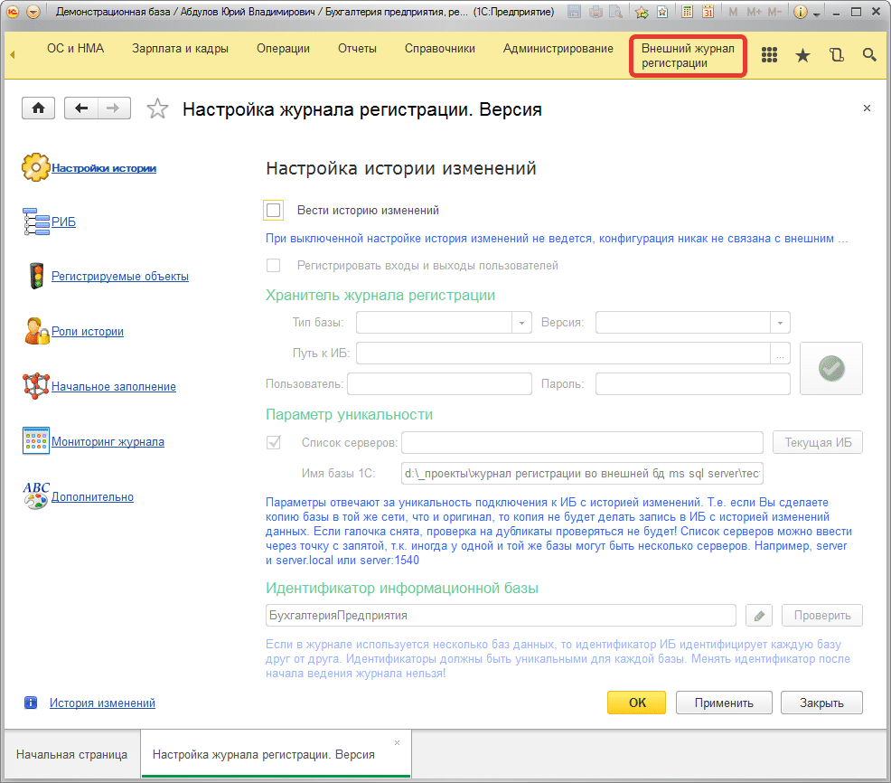
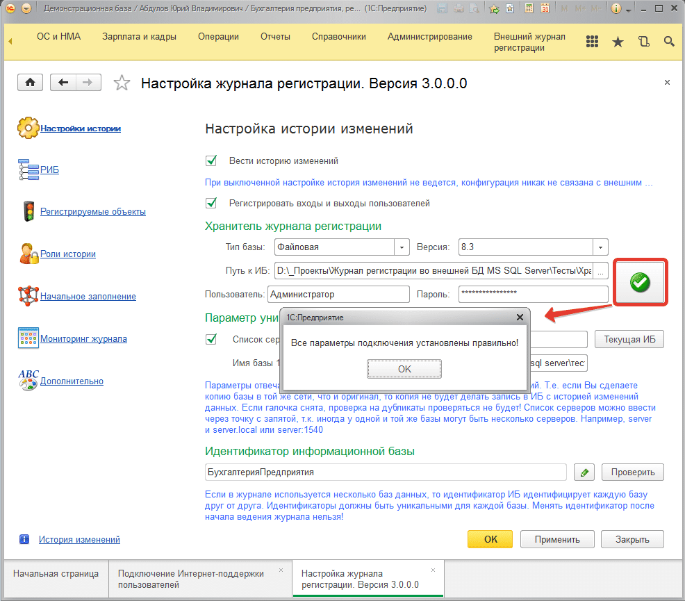

# Настройка связи подсистемы с «Хранитель журнала регистрации»  

1) После того, как подсистема внедрена и установлена конфигурация **«Хранитель журнала регистрации»**, необходимо настроить связь подсистемы в рабочей информационной базе журнала регистрации с базой данных хранителя.

Открываем конфигурацию в режиме предприятия и идем в раздел **«Внешний журнал регистрации»**. Далее, открываем пункт **«(ВН) Настройка журнала регистрации»**:

2) Включаем флаг **«Вести историю изменений»**. Эта опция **включает/отключает** запись всех изменений.

3) На этом шаге необходимо подключить текущую рабочую информационную базу к **«Хранителю журнала регистрации»**. В группе «Хранитель журнала регистрации» на скриншоте выше указываем тип базы хранителя (***файловая/серверная***), версию 1С ИБ хранителя, путь к базе хранителя (если ИБ файловая), имя сервера и имя базы (если ИБ серверная), пользователь и пароль. После чего необходимо нажать кнопку **«Проверить соединение»**. Получаем примерно следующее:

4) Так же необходимо задать **идентификатор информационной базы**, который будет отличать одну информационную базу от другой. Т.к. в **«Хранителе журнала регистрации»** могут храниться данные изменений разных информационных баз, то идентификатор должен быть уникальным в пределах одной базы. Если используется РИБ, то идентификаторы каждой из баз РИБ должен быть одинаковым. Уделите этому параметру особое внимание, т.к. из не правильной установка этого параметра подсистема может работать не корректно. Например, если есть РИБ базы УПП (УПП главная, УПП дочерняя 1, УПП дочерняя 2), то у них идентификатор должен быть одинаковым допустим «УПП», если же мы позже подключим конфигурацию «Зарплата и управление персоналом», то идентификатор для этой базы должен быть отличным от «УПП», допустим это будет «ЗУП» в таком случае все будет работать корректно.

5) Перейдите на закладку «РИБ» и установите идентификатор узла РИБ (о нем написано ниже). Это простая строка, заполните и укажите идентификатор, например, *«Главная ИБ»*.

6) Далее настраиваем историю по своему усмотрению. Все настройки отдельно описаны ниже.

