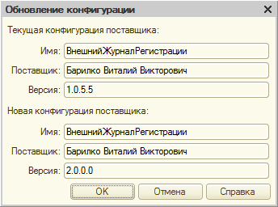
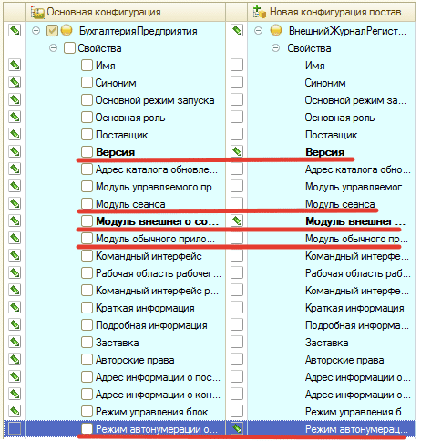

# Обновление подсистемы на более новую версию в рабочей базе 

Ни что не стоит на месте. В том числе и наша подсистема. Мы развиваемся, появляется дополнительный функционал, исправляются ошибки и недочеты. В связи с этим появляются обновления.

## Как их устанавливать? Об этом по порядку…

!!! Warning Важно! 
Перед обновлением подсистемы проследите, чтобы все события из кэша были перенесены в Хранитель
!!!

1) Устанавливаем дистрибутив обновления, который мы Вам выслали. Запоминаем путь, куда установилось обновление. Далее заходим в конфигуратор. Выбираем в меню **«Конфигурация > Поддержка > Обновить конфигурацию»**. В открывшемся окне **«Выбор файла обновлений»**, нажимаем **«Далее»**. Выбираем `cfu-файл` и нажимаем **«Готово»**.

2) После, того как мы выберем `cfu-файл` с обновлением, конфигурация спросит у нас:

Щелкнем **«ОК»**.

3) В появившемся окне снимем все галочки для свойств конфигурации:

Остальные галочки необходимо оставить

4) Далее необходимо поставить галочку в дереве метаданных **«Общие > Подсистемы > внЖурналРегистрации»**

5) Так же мы можем Вас попросить в письме с обновлением прислать дополнительные инструкции.

6) Нажимаем на кнопку **«Выполнить»**

7) После всего необходимо обновить конфигурацию базы данных, нажав `F7` или кнопку:

8) После этого необходимо запустить конфигурацию в режиме предприятия под пользователем с полными правами и правом **«(ВН) Администратор журнала регистрации»**.

9) После запуска в режиме Предприятия подсистема обновится и выведет Вам сообщение с указанием, что подсистема обновлена. Список изменений в новой версии можно посмотреть в настройках подсистемы.

!!!
**Готово. Подсистема обновлена.**
!!!