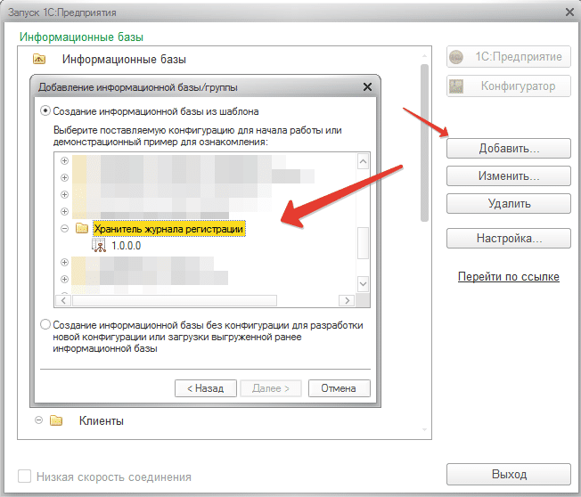

# Установка и настройка внешней ИБ «Хранитель журнала регистрации»

1) Установите дистрибутив поставки конфигурации, нажав `setup.exe` из полученного Вами дистрибутива из папки **«Хранитель журнала регистрации»**.

2) Далее откройте окно открытия конфигурации и добавьте новую информационную базу хранителя.

3) Запустите созданную конфигурацию, после запуска в конфигурацию будет добавлен пользователь и конфигурация может быть перезапущена автоматически.

4) После открытия назначьте добавленному пользователю **«Администратор»** пароль, чтобы в базу хранителя никто не смог зайти кроме администраторов. Добавить пароль: **«Настройка и администрирование > Настройка пользователей и прав > Пользователи»**. Откройте пользователя Администратор и установите ему пароль в поле **«Пароль»** и **«Подтверждение пароля»**. После чего нажмите «Записать и закрыть».

5) Конфигурацию хранителя можно считать установленной и готовой к работе.

!!! Warning Важно! 
Установку конфигурации «Хранитель» при больших объемах данных очень желательно устанавливать на сервер отличный от того, на котором находится рабочая информационная база.
!!!

