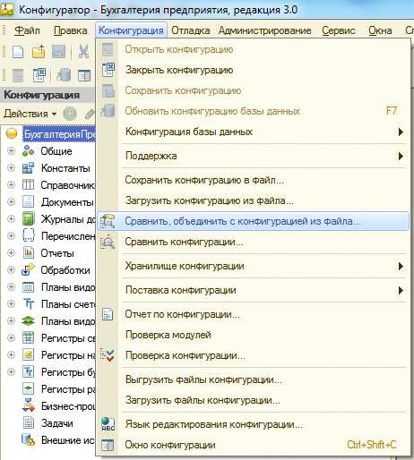

# Интеграция в конфигурацию

Подсистема интегрируется с любой конфигурацией «1С:Предприятие 8.2» и «1С:Предприятие 8.3».

# Установка подсистемы в основную конфигурацию 

1) Установите дистрибутив поставки конфигурации, нажав `setup.exe` из полученного Вами дистрибутива (запомните путь, куда будет установлен дистрибутив подсистемы).

2) Зайдите в конфигуратор информационной базы. Конфигурация может находиться на поддержке без возможности изменения (возле каждого объекта могут быть «замочки»). `«Замочки»` означают, что конфигурацию нельзя редактировать. Если замочков уже нет, идем к шагу 6.


3) Для того, чтобы открыть возможность редактирования конфигурации зайдите в меню: `«Конфигурация>Поддержка>Настройка поддержки»`


4) Включите возможность изменения конфигурации.


После этого будет задан вопрос:


Необходимо нажать `«Да»`. Далее появится окно:


Необходимо выбрать указанный пункт и нажать `OK`, немного подождать и закрыть окно **«Настройка поддержки»**.

5) После того как возможность изменения будет включена необходимо сохранить конфигурацию. Для этого нажмите `F7`.

6) В меню выберите пункт **«Конфигурация>Сравнить и объединить с конфигурацией из файла»**:



7) После чего укажите файл `1Cv8.cf` из каталога установленного дистрибутива нашей подсистемы на первом шаге и подпапке «journ», например, в Windows 7 путь будет следующим:

`«c:\Users\<Имя учетной записи>\AppData\Roaming\1C\1Cv82\tmplts\journ\».`

Будет задан вопрос о постановке на поддержку:


Нажимаем `«Да»`.

8) Откроется окно сравнения, объединения с конфигураций. В этом окне необходимо снять флажок с корневого элемента дерева. Будут сняты все флажки.


9) Нажимаем в этом окне **«Действия>Отметить по подсистемам файла»**


Выбираем указанные флаги и нажимаем **«Установить»**.

10) После этого в подсистемах устанавливаем флаг возле строки **«внЖурналРегистриации» (в дереве объектов Общие>Подсистемы).**


11) Нажмите кнопку **«Выполнить»**. Появится диалоговое окно:


Нажмите **«OK»**. После чего сохраните конфигурацию нажав `F7`.

12) Теперь необходимо добавить служебный код, чтобы подсистема смогла работать при запуске:


Правой кнопкой по корню конфигурации и можно открыть любой модуль

Для управляемого приложения (управляемое приложение):

В начало процедуры ПриНачалеРаботыСистемы:

```bsl
Процедура ПриНачалеРаботыСистемы()
//<< вн
внЖурналРегистрацииКлиент.ПриНачалеРаботыСистемы();
//>>

Процедура ПриНачалеРаботыСистемы()

//<< вн

внЖурналРегистрацииКлиент.ПриНачалеРаботыСистемы();

//>>


В конец процедуры ПриЗавершенииРаботыСистемы (если ее нет, создать):

Процедура ПриЗавершенииРаботыСистемы()

…

// Добавляем в конец процедуры

//<< вн

внЖурналРегистрацииКлиент.ПриЗавершенииРаботыСистемы();

//>>

КонецПроцедуры

Модуль внешнего соединения должен выглядеть вот так:

Процедура ПриНачалеРаботыСистемы()

//<< вн

внЖурналРегистрацииКлиент.ПриНачалеРаботыСистемы();

//>>

КонецПроцедуры

Процедура ПриЗавершенииРаботыСистемы()

//<< вн

внЖурналРегистрацииКлиент.ПриЗавершенииРаботыСистемы();

//>>

КонецПроцедуры

Модуль сеанса (если процедуры УстановкаПараметровСеанса нет, то создать ее):

Процедура УстановкаПараметровСеанса(ТребуемыеПараметры)

//<< вн

внЖурналРегистрации.УстановкаПараметровСеанса(ТребуемыеПараметры);

//>>

КонецПроцедуры

```
В конфигурациях на основе БСП (*Бухгалтерия предприятия 3.0, Управление торговлей 11.2 и т.п.*) в последних версиях появилась необходимость в общий модуль ПользователиПереопределяемый в процедуру ПриОпределенииНазначенияРолей добавить:

```bsl
…
НазначениеРолей.ТолькоДляПользователейСистемы.Добавить(Метаданные.Роли.внАдминистраторЖурналаРегистрации.Имя);
НазначениеРолей.ТолькоДляПользователейСистемы.Добавить(Метаданные.Роли.внПросмотрЖурналаРегистрации.Имя);
```
Это необходимо, делать только в конфигурациях на базе БСП, если в вашей конфигурации нет такого общего модуля и аналогичной процедуры в нем, то добавлять туда ничего не нужно.
Если указанные процедуры уже существуют, необходимо добавить в них все блоки, которые начинаются с `//<< вн` и заканчиваются `//>>`, если этих процедур нет, необходимо их создать.

## Для обычного приложения (обычные формы)

Для обычного приложения все аналогично только вместо модуля управляемого приложения необходимо изменить модуль обычного приложения.

!!! Warning Важно!
Если приложение может работать как в толстом, так и в тонком клиенте, то необходимо изменить и модуль управляемого и модуль обычного приложения.
!!!

13) Откройте в конфигураторе в меню: «Администрирование>Пользователи» и у текущего пользователя, под которым происходит интеграция подсистемы, добавьте права «(ВН) Администратор журнала регистрации», для того, чтобы в режиме предприятия после запуска этого пользователя можно было настроить наш журнал регистрации:

!!! Warning Важно! 
Если в конфигурации **нет пользователей, то их необходимо их создать!** Без пользователей подсистема не будет работать!
!!!

14) Последний пункт. Если ваша информационная база работает на основе библиотеки стандартных подсистем, она же БСП, то необходимо в параметрах запуска указать дополнительный параметр запуска:

*«/С ЗапуститьОбновлениеИнформационнойБазы»* (без кавычек). Это можно сделать как из конфигуратора (тогда первый запуск в режиме предприятия необходимо осуществить из конфигуратора), так и при запуске в режиме предприятия.

### Запуск из конфигуратора.

В конфигураторе **Меню > Сервис > Параметры** вкладка **Запуск 1С:Предприятие** в поле **«Параметры запуска»** указать **«/С ЗапуститьОбновлениеИнформационнойБазы»**. Пример:


Потом выполнить запуск конфигурации в режиме предприятия из конфигуратора нажав **«Начать отладку»** (или `F5`).

### Запуск в режиме предприятия без отладки.

Нажмите кнопку **«Изменить»**, затем **«Далее»**, **«Далее»** и на указанной как в скриншоте ниже странице измените дополнительные параметры запуска:


### Настройка подсистемы в конфигураторе завершена. Запускайте конфигурацию в режиме предприятия.