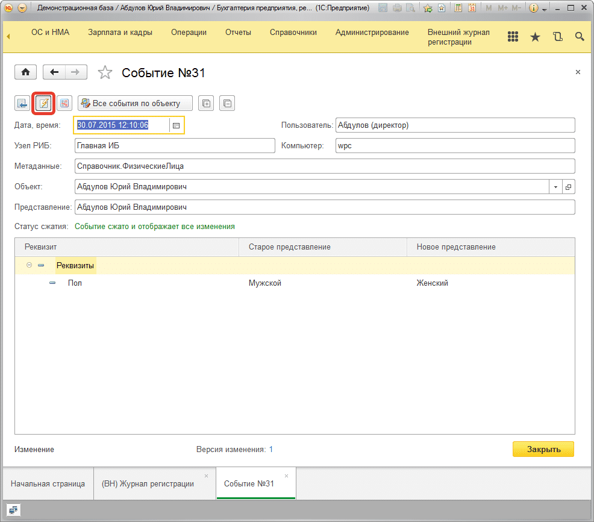

# Закладка «Дополнительно»

## Период просмотра в журнале по умолчанию. 
Для быстроты выборки по умолчанию выбираются не все изменения в журнале регистрации, а только те, которые были за последнее время. Ведь обычно в журнал смотрят только тогда, когда что-то произошло, а произойти это могло, как правило, недавно. Поэтому, на этой закладке, можно указать какой период будет показываться по умолчанию при открытии журнала *(при установке подсистемы присваивается «За последний месяц»)*. Естественно после открытия журнала период отображаемых изменений может быть изменен.

## Открывать события с фильтром изменений.
Этот флаг указывает на то, чтобы открываемое событие отображало только те данные, которые были действительно изменены.

Если кнопку отжать, то будут видны все реквизиты события, если же она будет нажата, то только изменения. По умолчанию, если галочка «Открывать события с фильтром изменений» в настройках установлена, то события будут открываться с нажатой кнопкой в событии, что позволит сразу видеть только изменения.

## Способ определения представления

**Эта настройка может принимать два значения:**

**1) При регистрации**

Это предпочтительный способ регистрации изменений подсистемой, но он работает медленнее. При выбранном способе детальные изменения события сразу фиксируются в кэше. Этот способ лучше по удобству работы, но хуже по производительности. Все значения реквизитов события записываются в кэш построчно, что позволяет быть уверенным, что в случае поиска вы найдете все, что было в событиях, которые еще не перенесены из кэша в хранитель.

**2) В регламентном задании**

Способ, который очень быстро работает. Значительно быстрее первого варианта, но он менее гибок. Реквизиты, которые записываются для всех реквизитов объектов, не записываются построчно, а записываются скопом. Это работает гораздо быстрее, но если вы захотите установить отбор по событиям, у которых в изменениях есть такое-то значение реквизита, то у Вас для событий, которые еще находятся в кэше ничего не получится. Конечно, если регламентное задание по переносу кэша настроено на выполнение один раз в 60 секунд, то вполне возможно вы и не столкнётесь с подобным. Так же этот способ необходимо использовать, когда количество одновременно работающих пользователей более 50.

Падение производительности получается в основном для огромных объектов или наборов записей, для небольших и средних объектов разница между 1) и 2) будет не сильно заметной.
