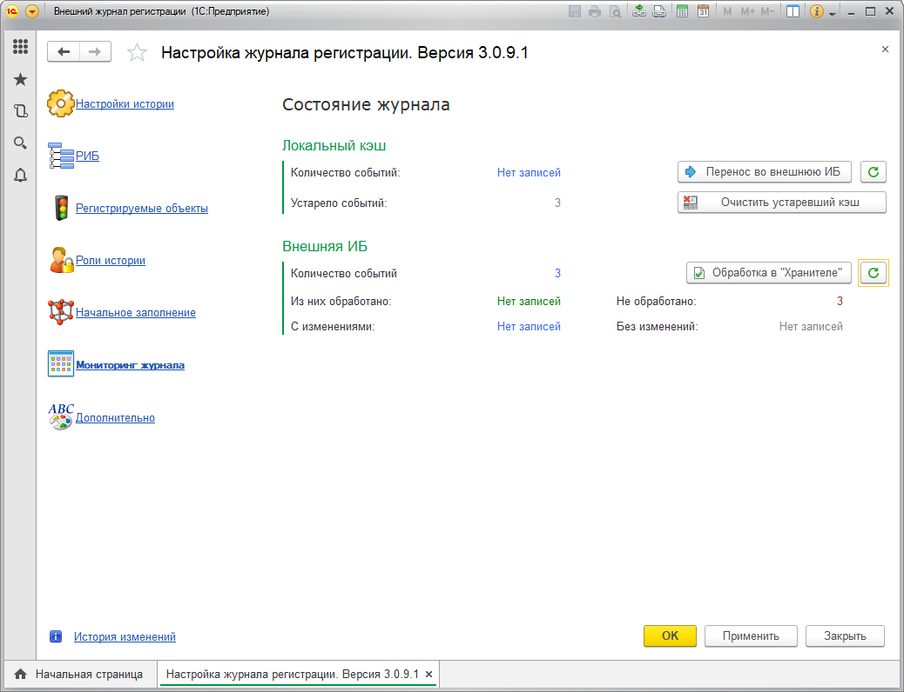

# Закладка «Мониторинг журнала»
## Эта вкладка предназначена для просмотра состояния кэша журнала регистрации и количества записей во внешней ИБ хранилища.

Тут же можно перенести данные из локального кэша во внешнюю ИБ хранилища, очистить устаревшие данные из кэша, или запустить обработку в базе **«Хранителя»**.

!!! Warning Внимание! 
Нажатие кнопок на этой странице приведет к ПОЛНОМУ выполнению заданий. Например, при нажатии на перенос из кэша в Хранитель, произойдет ПОЛНЫЙ перенос событий. Т.к. это событие очень долгое мы рекомендуем правильно настроить регламентное задание и запустить его.
!!!