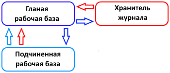

# Закладка «РИБ»

**РИБ** – это распределенная информационная база. Если у вас нет РИБ или Вы не знаете, что это такое, пропустите данный пункт.

## В нашей подсистеме реализовано два типа обмена при использовании РИБ:

### Обмен через РИБ "Хранитель журнала регистрации";
Обмен кэшем журнала регистрации через типовой РИБ;

Подробнее мы их рассмотрим ниже.

Идентификатор узла РИБ предназначен для отметки текущего узла РИБ. Это строка, которая отличает одну базу РИБ от другой. Этот идентификатор должен быть для каждого узла разным. Для нашего примера с УПП для баз *(УПП главная, УПП дочерняя 1, УПП дочерняя 2)* идентификатор ИБ будет УПП, а для каждого из этих УПП идентификаторы узлов РИБ будут разными *(например, Главная, Дочерняя 1, Дочерняя 2)*.

Список информационных базы РИБ отражает полностью все информационные базы 1С, которые учувствуют в РИБ. При этом, как при полном, так и при упрощенном обмене данные по узлам дочерних РИБ перенесутся, самостоятельно и создавать их не нужно.

Рассмотрим по порядку, типы обмена, реализованные в нашей подсистеме:

Обмен кэшем журнала регистрации через типовой РИБ
Если выбран данный тип, то в дочерних узлах нельзя посмотреть журнал регистрации, там не происходит сжатия объектов. Историю изменений объекта можно посмотреть ТОЛЬКО в главном узле РИБ.



#### Схема работы по шагам, следующая:

1. При изменении объекта в дочерней базе РИБ, происходит запись полного образа объекта в справочник-кэш журнала регистрации;

2. При обмене с центральной базой РИБ происходит передача всех данных об изменениях из справочника-кэша дочерней базы РИБ в справочник-кэш главной базы РИБ;

3. Происходит перенос кэша из главной базы РИБ в базу хранителя, после чего данные кэша очищаются.

4. При следующем обмене с дочерней базой будет передана информация о том, что переданные данные кэша загружены из центральной базы в базу хранителя и данные кэша в дочерней базе РИБ будут удалены.

**Плюсы:**

* Фиксируется какой пользователь РИБ сделал изменения объекта;

* Фиксируется в какой информационной базе сделаны изменения объекта;

* Реализуется обмен типовыми средствами РИБ;

**Минусы:**

* Нет возможности посмотреть журнал регистрации в дочерних базах РИБ. Анализ изменений можно провести только в главной базе РИБ.

* Значительное увеличение объема передаваемых данных, т.к. передаются из кэша все значения изменений. Как следствие увеличение времени обмена и объема передаваемых данных.

* Последний минус можно нивелировать, если использовать малые интервалы обмена, т.к. при таком обмене объемы справочника-кэша возрастут не существенно. Соответственно этот вариант подойдет.

#### Как использовать?

Для включения данного типа обмена необходимо:

1) Во всех базах 1установить галочку «Вести историю изменений».

2) Во всех дочерних базах 1С НЕ ЗАПОЛНЯТЬ на закладке «Настройки истории» параметры доступа к базе хранителя и оставить поля пустыми.

3) На закладке РИБ подсистемы всех баз установить тип использования РИБ «Обмен кэшем журнала регистрации через типовой РИБ».

4) Открыть план обмена, по которому осуществляется обмен в РИБ в режиме конфигуратора и включить в план обмена следующие объекты:

```bsl
Справочник.внКэшЖурналаРегистрации

РегистрСведений.внИзменения

РегистрСведений.внНеРегистрируемыеОбъекты
```
5) Установите регламентное сжатие журнала регистрации в главной информационной базе таким образом, **чтобы сжатие приходилось на тот момент, когда все обмены с подчиненными базами уже произведены, это важно!**

6) Журнал настроен на работу в РИБ с данным типом.

### Обмен через РИБ "Хранитель журнала регистрации"
Схема работы данного типа в РИБ:


Суть такова, что РИБ организовывается в ИБ «Хранитель журнала регистрации».

В отличие от предыдущего типа обмена, этот тип имеет свои преимущества и недостатки:

**Плюсы:**

* Фиксируется в какой узле РИБ основной базы сделаны изменения объекта;

* Объем передаваемых данных по РИБ основной базы не увеличится и останется на прежнем уровне;

* В каждом из дочерних узлов РИБ можно использовать свой журнал изменений;

* Реализуется обмен типовыми средствами РИБ;

* Гибкие настройки выгрузки данных в дочерние базы РИБ хранителя (по информационной базе/по узлам РИБ/по дате выгрузки)

**Минусы:**

* Необходим отдельный обмен между узлами хранителя журнала регистрации;

* Определение изменений происходит только в главном узле хранителя и потом «спускается» по цепочке в дочерние узлы;

* Т.к. в файловых базах 1С есть ограничения в 4 Гб на одну таблицу, то в некоторых случаях использование файловых баз хранителя в филиалах может быть затруднительно, т.к. объемы изменений могут быть больше чем 4 Гб. Это следует учитывать. Хотя на этом этапе могут помочь правильная настройка очистки данных в базе хранителя.

**Какой из способов подходит больше – выбирать Вам!**


