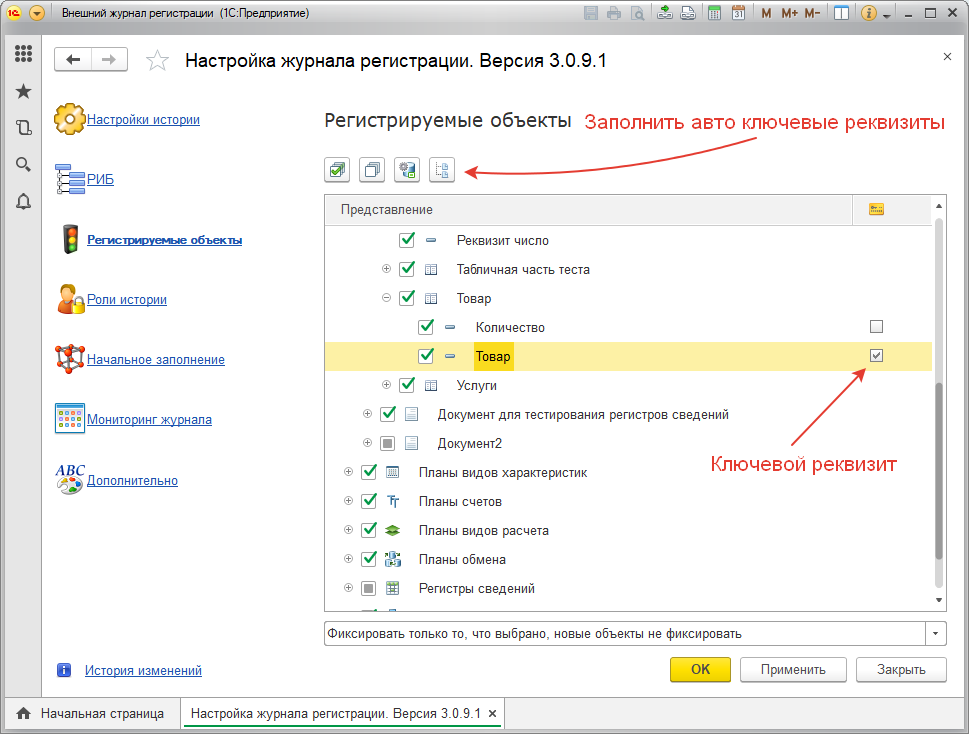

# Закладка «Регистрируемые объекты»
Здесь можно выбрать те объекты их реквизиты и табличные части, по которым необходимо отслеживать изменения.

Есть возможность настроить список объектов, по которым не нужно отслеживать изменения. Скажем больше: такая возможность просто необходима! Так как в типовых конфигурациях есть, например, справочники «Сохраненные настройки» или «Рабочие места», по которым нет необходимости вести историю изменений т.к. эти справочники служебные и могут быть изменены при входе/выходе самой конфигурацией. Пройдитесь по всем объектам конфигурации на этой закладке и отключите лишние, что бы по ним не фиксировалась история изменений.

!!! Warning ВАЖНО! 
Оставьте только те регистры сведений, по которым действительно необходимо отслеживать изменения. Т.к. от ведения журнала регистрации по всем регистрам сведений, может сильно упасть производительность и увеличиться объем записываемых данных! Например, регистры сведений типа: «Даты запрета изменения данных», или «Ответственные лица» можно оставить, а «Адресный классификатор» – выключить и т.д.
!!!

## Ключевые реквизиты
На этой закладке так же есть в табличных частях ключевые реквизиты

Ключевые реквизиты предназначены для группировки строк в табличных частях объектов в определении изменений.  

### Зачем нужны ключевые реквизиты лучше рассмотреть на примере:

***Пример:***  
Есть документ **"Реализация товаров и услуг"**, в нем есть таблица **"Товары"**, в которой куча реквизитов среди которых *"Товар", "Характеристика" и "Количество"*. Теперь смотрите, если в табличной части производят сортировку или сдвигают строки вверх или внизу, а потом записывают документ, подсистема в событии документа не должна показать изменения.  
Механизм ключевых реквизитов введен специально для этих целей. Необходимо указать что столбцы *"Товар", "Характеристика*" в табличной части **"Товары"** являются ключевыми. А изменения по этой табличной части станут определяться по ключевым полям. Если добавили новую пару товар-характеристика, то это добавление новой строки. Если изменили товар или характеристику уже у существующей строки, то это удаление данных по старым ключевым полям и добавление по новым. Если удалили строку, то это удаление строки.  
Если переместили строку, то в таблице пары ключевых полей товар-характеристика - не изменились, а значит нет изменений в табличной части (но запись события запишется, просто в табличной части не будет изменений).

Если ключевые поля не отмечать, то в качестве ключевого поля будет поле **"Номер строки"**.

