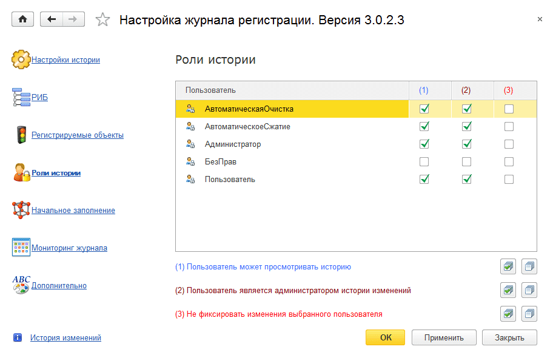
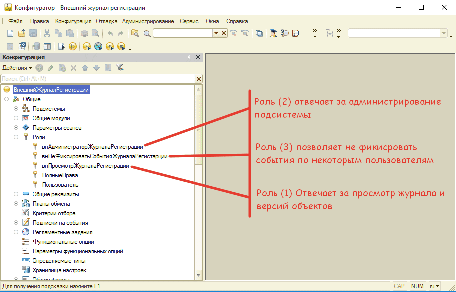

# Закладка «Роли истории»

Эта вкладка предназначена для установки прав всем пользователям, по которым будут фиксироваться изменения.   
Как правило – это все пользователи.  
Здесь можно быстро всем назначить права для фиксирования изменений или просмотра истории.

## В режиме предприятия роли выглядят следующим образом:

* **Роль (1)** – кто может просматривать журнал регистрации;

* **Роль (2)** – кто является администратором журнала регистрации.

* **Роль (3)** – не фиксировать события этого пользователя

При установке подсистемы роль для администрирования журнала регистрации необходимо добавить в конфигураторе (об этом было написано выше, но на всякий случай повторим).

## Роли в конфигураторе выглядят следующим образом:

Назначать роли проще и быстрее в режиме предприятия, в настройках подсистемы.

Если с первыми двумя ролями все понятно, спросите вы, то зачем нужна роль (3)? Все просто, роль (3) нужна для того, чтобы не фиксировать изменения, которые делают пользователи в некоторых случаях. Например, если предполагается перепроведение документов и вам это необходимо сделать быстро, то эта роль может вам помочь. Для этого установите ее себе, перезапустите конфигурацию, выполните массовое перепроведение, а затем снимите эту роль.

!!! Warning Важно! 
Если Вы используете конфигурацию на основе Библиотеки Стандартных Подсистем *(УТ11, БП 3.0, ЗУП 3.0, КА, УНФ и т.д.)*.  
Подход с правами пользователей меняется. Об этом в следующей главе.
!!!
