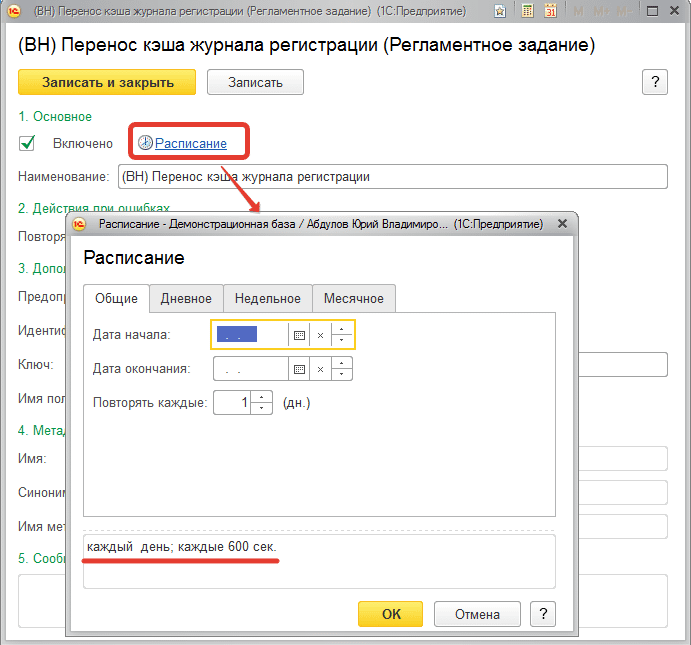
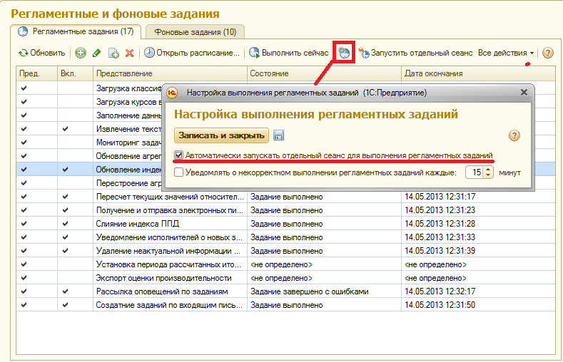
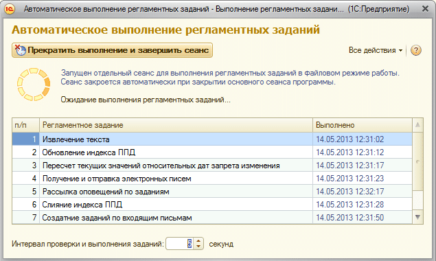
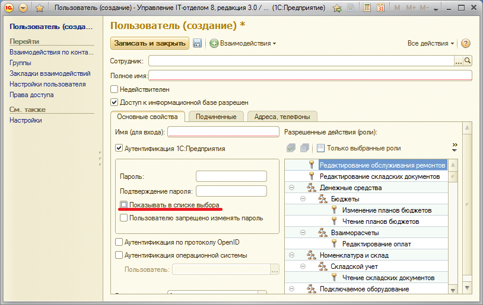

# Запуск регламентных заданий по переносу кэша журнала регистрации

## Настройка регламентоного задания в конфигурации
Изменения журнала регистрации хранятся в двух объектах: кэша записи истории и базе данных хранителя. Понятное, что перенос данных из кэша должен работать без участия пользователя. Для этих целей было создано регламентное задание: **«(ВН) Перенос кэша журнала регистрации»**, которое автоматически, с заданной периодичностью переносит данные из кэша в базу данных хранителя.

Если у вас конфигурация на основе БСП (УТ11, КА, УНФ и т.д.), Вам необходимо создать регламентное задание в режиме предприятия. Для этого перейти во вкладку **«Администрирование»**, там выбрать **«Поддержка и обслуживание»**, в открытой обработке **«Регламентные и фоновые задания»**.

Добавьте в список регламентных заданий, задание «(ВН) Перенос кэша журнала регистрации» по кнопке «Расписание» установите достаточно маленький интервал для запуска регламентного задания.  
**Например, «Каждые 600 сек»** - это через каждые 10 минут. Т.е. данные с кэша будут переноситься в базу хранителя каждые 10 минут. Интервал желательно поставить в таком районе, чтобы данные по изменениям в случае чего были получены за минимальное время.

Запуск регламентных заданий в файловом и клиент-серверном варианте работы конфигурации отличается. Рассмотрим их по порядку:

*Вариант 1. Клиент-серверный вариант и файловый вариант (для 8.3)*

Регламентное задание запускается в серверном варианте автоматически. И не требует дополнительной настройки. В файловом варианте для платформы 8.3, так же он запускается автоматически.

*Вариант 2. Файловый вариант работы (только для 8.2)*

В файловом варианте. Необходимо либо запускать регламентное задание в отдельном сеансе, как на рисунке ниже:

В таком случае от вашего пользователя, как только вы запустите конфигурацию, будет запущено дополнительно сеанс с обработкой регламентных заданий.

**Либо запускать фоновые задания через планировщик Windows:**

## Запуск фонового задания через Windows

В конфигурации создайте пользователя в режиме предприятия, при создании уберите галочку **«Показывать в списке выбора»**. Задайте ему имя и пароль.  
Установите для него полные права.  
Это пользователь, под которым будут автоматически запускаться регламентные задания.

Далее, откройте **«Панель управления > Все элементы панели управления > Администрирование»** компьютера, где будут запускаться регламентные задания.  
*Желательно (но не обязательно), чтобы этот компьютер был постоянно включенным.*

### Параметры информационной базы при запуске 1С Предприятия 8 для включения автоматического выполнения регламентных заданий.

|Параметр          |Описание                                            |
|------------------|----------------------------------------------------|
|DoScheduledJobs   |Выполнять регламентные задания в открываемом сеансе.|
|SkipMessageBox    |Не показывать предупреждения, в случаях, когда сеанс, выполняющий задания, уже открыт или есть другие причины, препятствующие выполнению заданий в открываемом сеансе.|
|AloneIBSession    |Запустить сеанс только для выполнения регламентных заданий. Если сеанс для целей выполнения заданий уже открыт, то открываемый сеанс будет завершен с предупреждением (или без предупреждения см.SkipMessageBox).|

***Примеры строки программы в ярлыке Windows.***

|Назначение    |Строка      |
|--------------|------------|
|Включить выполнение заданий в открываемом сеансе.|"C:\Program Files\1cv82\Bin\1cv8c.exe" /CDoScheduledJobs|
Запустить сеанс только для выполнения заданий. Например, если каталог информационной базы расположен на отдельном компьютере, то эту строку можно записать в планировщик Windows. Лишний запуск сеанса будет автоматически завершен.|"C:\Program Files\1cv82\Bin\1cv8c.exe" ENTERPRISE /F"C:\Информационная база"; /NВасилий /PПароль /C"DoScheduledJobs SkipMessageBox AloneIBSession"|

Вот работающий пример запуска фоновых заданий, который запускает сеанс и в нем выполняются регламентные задания.

"C:\Program Files (x86)\1cv82\8.2.17.169\bin\1cv8c.exe" ENTERPRISE /F"C:\buh"; /N"Администратор" /P112233 /C"DoScheduledJobs SkipMessageBox AloneIBSession"

Для тестирования работы запустите команду Выше (с учетом расположения своей базы, логина, пароля, а так же версии платформы) нажав `Windows + R` и в открывшемся окне вставить и запустить указанный пример. Должен запуститься сеанс 1С:Предприятие, в котором будет работать обработка.

!!! Warning Внимание! 
В 1С версии 8.3 в файловом варианте автоматически запускаются регламентные задания от пользователя, для него делать отдельный сеанс не нужно.
!!!