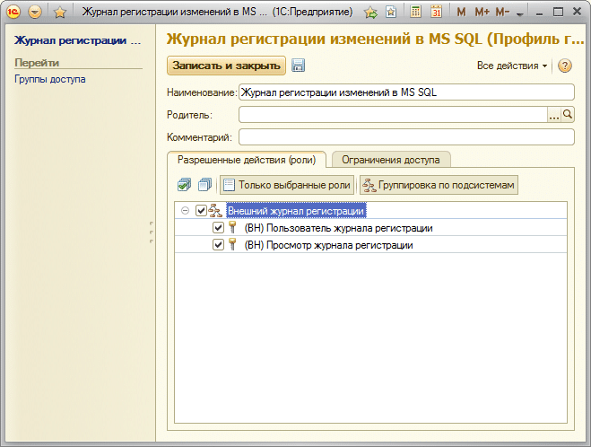
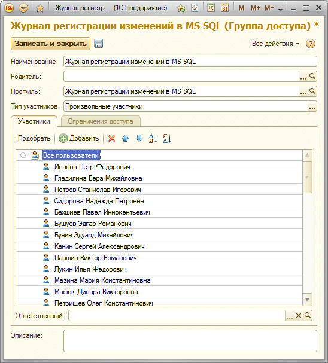

# Назначение ролей через профили доступа

> В конфигурациях на основе БСП будут проблемы с назначением прав пользователей. Все дело в том, что в них изменен механизм назначения прав.   
Пользователей разбивают на группы доступа, создают профили групп доступа и добавляют пользователей в данные группы. Таким образом, пользователям назначаются права.  
При добавлении новых пользователей они помещаются в группу, после записи этой группы права пользователям, которые находятся в ней, переназначаются. То есть, если мы воспользуемся нашей обработкой для назначения прав и установим всем права, а затем добавим пользователя в какую-нибудь группу и сохраним изменения, то для пользователей этой группы права будут перезаписаны и роли, которые мы добавили через нашу подсистему, пропадут! Как я уже сказал – это тонкости библиотеки стандартных подсистем.

## Создание профиля группы доступа 
Для того, чтобы постоянно не подправлять роли, необходимо создать свой профиль группы доступа и группу доступа.  
Для этого перейдите на вкладку **«Администрирование»** и найдите там **«Настройки пользователей и прав»**.

Открываем профили групп доступа и добавляем свой профиль с указанными ниже правами (можете выбрать только «(ВН) Просмотр журнала регистрации», тогда пользователи не смогут просматривать журнал):

В этой форме нажимаем **«Записать»** (значок дискетки) и переходим на дополнительный пункт **«Группы доступа»** пункта **«Перейти»**, здесь же.  
Добавляем туда группу доступа:

Нажимаем **«Добавить»** и щелкаем на пункт **«Все пользователи»**, чтобы добавить всех пользователей системы сразу, а не добавлять каждого по отдельности. По окончании записываем группу.

**Все! Теперь при изменении любых прав выбранные права на наш журнал регистрации не будут пропадать.**

!!! Warning Важно! 
Не забывайте при добавлении пользователей добавлять их в данную группу. Иначе по ним не будут фиксироваться изменения.
!!!