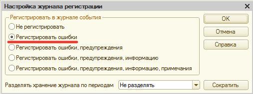

# Отключение стандартного журнала регистрации

После того, как подсистема установлена и эксплуатируется надобность в типовом журнале регистрации отпадает. Мы рекомендуем не отключать его полностью, а оставить регистрацию только ошибок. Это позволит в случае возникновения каких-либо проблем в конфигурации, или нашей подсистеме, администратору информационной базы быть в курсе.

Для отключения стандартного журнала регистрации зайдите в конфигурацию с административными правами, убедитесь, что в режиме предприятия с конфигурацией никто не работает, в меню **«Администрирование > Настройки журнала регистрации…»**, выберите пункт **«Регистрировать ошибки»**:

После этого нажмите **«ОК»**.

**Все. Теперь в типовом журнале регистрации будут регистрироваться только ошибки.**