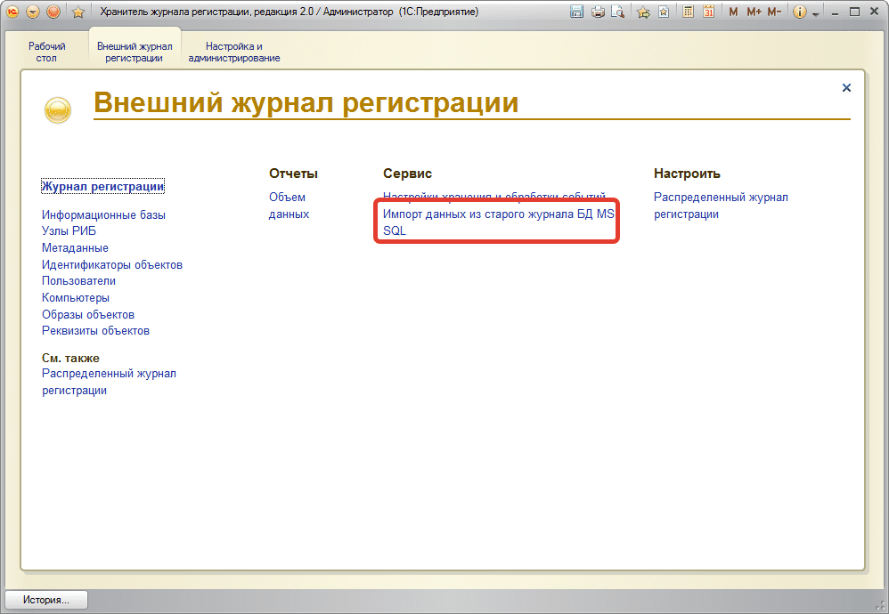
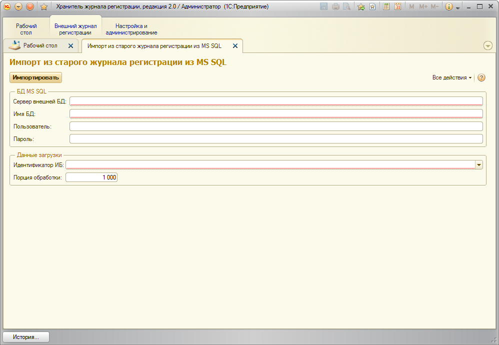

# Импорт данных из старого журнала регистрации из БД MS SQL

Откройте информационную базу хранителя и запустите обработку:

В обработке укажите параметры доступа к старому журналу в БД MS SQL:

После установки параметров нажмите на кнопку «Импортировать» и дождитесь окончания импорта. Этот процесс может быть очень долгим, все зависит от количества изменений в старом журнале.
!!! Warning Важно!  
Если вы прервете процесс загрузки, а потом запустите его снова, то процесс не будет стартовать с начала, а продолжится с того места где был завершен.
!!!
