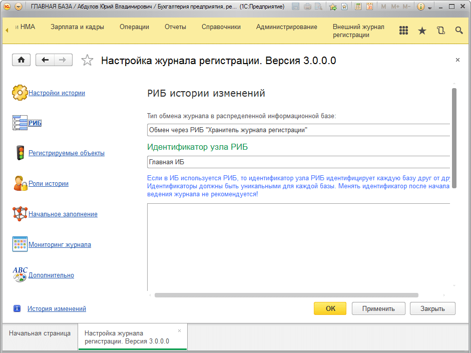
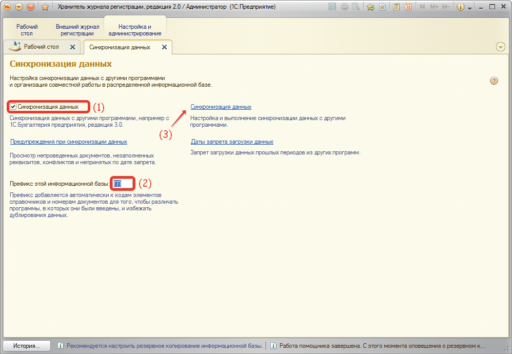
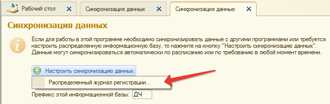
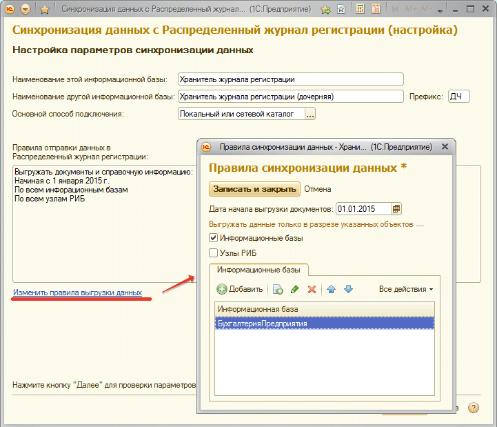
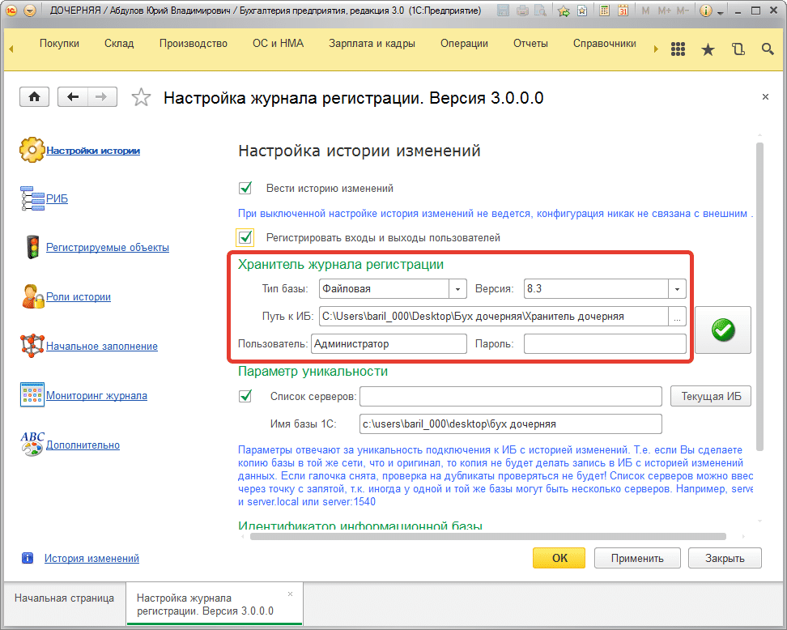
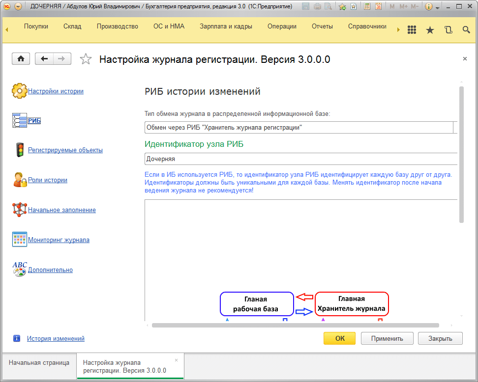
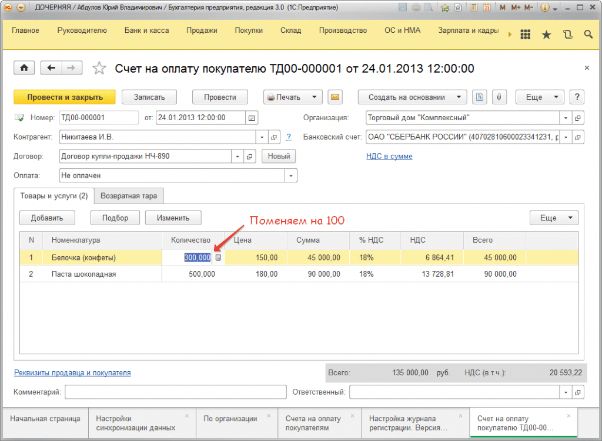
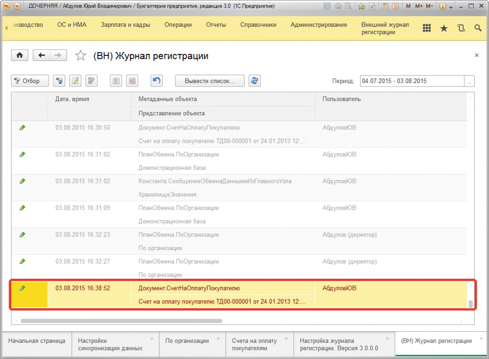
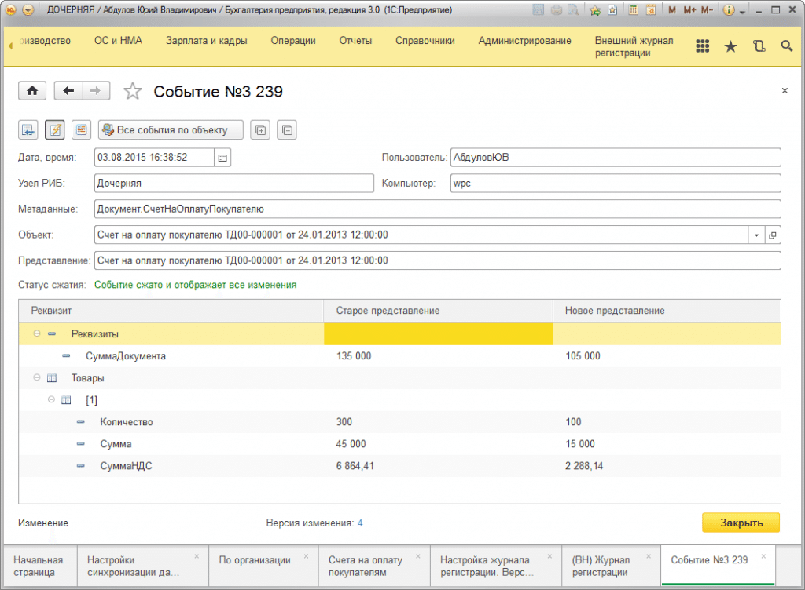

# Настройка распределенной ИБ «Хранитель журнала регистрации».

## Рассмотрим настройку на сквозном примере.

Пусть у нас есть две рабочие базы **БП 3.0** Главная и **БП 3.0** Дочерняя. Для них мы хотим настроить хранителей и использовать так же РИБ для баз хранителя.

Если вы хотите использовать распределенную ИБ хранителя, то для этого необходимо сначала настроить основную информационную базу, где в настройках, на закладке РИБ в качестве типа обмена в РИБ указать **«Обмен через РИБ Хранитель журнала регистрации»** и указать уникальный идентификатор узла РИБ.

Далее перенести подсистему в каждый из узлов рабочей информационной базы, путем обмена и обновления дочерних конфигураций, и для каждой из дочерних информационных баз задать в настройках типа обмена в РИБ указать «Обмен через РИБ «Хранитель журнала регистрации» и указать уникальный идентификатор узла РИБ (для каждой базы этот идентификатор должен быть уникальным).

**Причем идентификатор информационной базы у всех баз должен быть одинаковым.**
!!! Warning Важно! 
Еще раз повторю. Идентификатор информационной базы на закладке «Настройки истории» у всех рабочих баз РИБ должен быть одинаковым, а на закладке РИБ – идентификатор узла РИБ разным.
!!!

Итак, по шагам:

1) Предполагается, что дочерняя БП 3.0 уже создана и функционирует. А в главной настроен внешний журнал регистрации.

2) Откройте главную базу БП 3.0 и в настройках укажите:

3) Откройте **«Хранитель журнала регистрации»** главной базы, зайдите в подсистему **«Настройка и администрирование»** выберите **«Синхронизация данных»**.  
Задайте префикс и включите синхронизацию:

4) Откройте **«Синхронизацию данных»** и настройте обмен:

5) Создайте и настройте обмен, обратите внимание, что в процессе настройки есть возможность не полностью сделать образ объекта, а выгружать в дочернюю базу хранителя, только информацию по конкретной базе или узлу.

!!!
Обратите внимание, в процессе настройки дочерней базы хранителя, можно задать настройки. Чтобы хранитель с дочерними базами обменивался только тем, чем необходимо. Если в филиалах в дочерних базах хотят тоже смотреть журнал по всем изменениям, то нужно указать только информационную базу. Если будет выбран узел/узлы РИБ, то в дочерней рабочей БП 3.0 можно будет увидеть только изменения в журнале по выбранным узлам, а не по базе в целом.
!!!
6) После создания дочерней ИБ хранителя, подключим дочернюю ИБ хранителя, к дочерней БП 3.0:

7) Проверим как работает. Сделаем изменение в дочерней БП 3.0 изменим у документа **«Счет на оплату покупателю»** в первой строке количество с 300 на 100:

8) Видим, что в дочерней БП 3.0 появилось изменение в журнале:

9) Дождемся выполнения переноса события из журнала в **«Хранитель журнала регистрации»** регламентным заданием (либо выполним перемещение вручную).

10) Проведем обмен между БП 3.0 Главная <-> БП 3.0 Дочерняя.

11) Документ с изменением был перегружен, но событие где объект был изменен не было загружено.

12) Теперь проведем обмен между «Хранитель журнала регистрации» Главной и Дочерней.

13) После того как в главной ИБ хранителя будет выполнено регламентное задание, по определению изменений в событиях и произойдет следующий обмен между ИБ хранителей получим в обеих рабочих базах при просмотре истории следующую картинку:

14) При изменении реквизита «Количество» в первой строке, кроме всего прочего, за собой изменил «Сумму», «СуммуНДС» в этой же строке, а также в реквизитах документа изменилась «СуммаДокумента».

Пусть вас не смущает большое количество шагов, которое описано в примере. Все они выполняются в автоматическом режиме регламентными заданиями, мы попытались подробно рассмотреть, как работает обмен в РИБ хранителей.

!!! Warning Важно! 
При обмене в рабочих базах изменения не фиксируются в кэше, предполагается, что события по изменениям регистрируются и переносятся в ИБ хранителе(ях).
!!!

!!! Warning Важно! 
Важно! При использовании в филиалах вашей организации файловых баз для ИБ хранителя имейте ввиду, что максимальный размер в файловой базе 1С одной таблицы может достигать 4 Гб.
!!!
