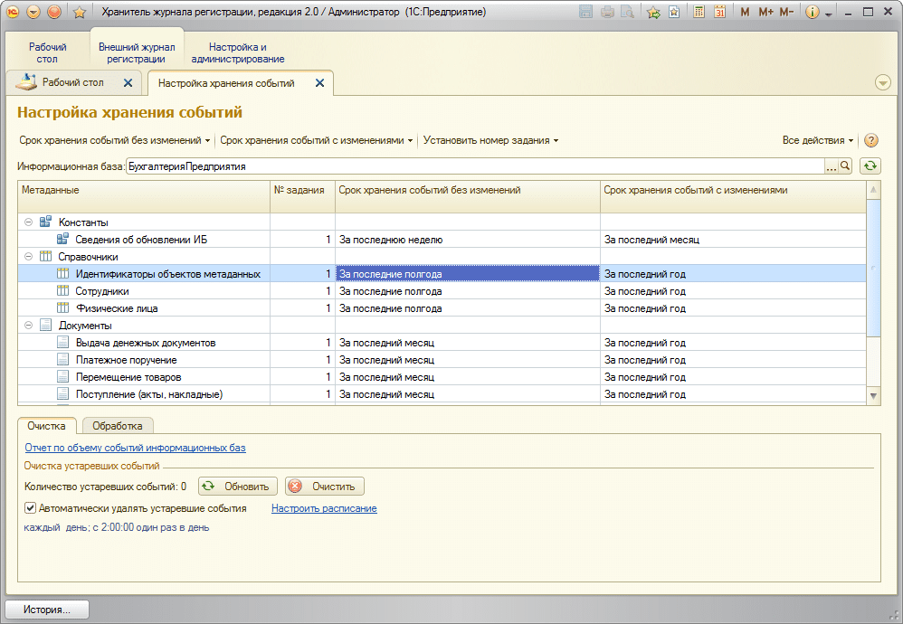

# Настройка хранения и обработки событий

Настройки этой формы позволяют указать как долго хранить события. Есть два вида событий: те в которых были измененные реквизиты и те, которые не были изменены после записи (например, открыли справочник ничего не изменили и нажали `«Записать»`). Удаление этих видов событий можно настроить отдельно для каждого вида объектов метаданных. Допустим три месяца хранить события, в которых были изменения и одну неделю те события, которые не содержат изменений. События, которые не содержат изменений тоже важны. Например, документ, которые будет перепроведен тоже не будет содержать изменений, но тем не менее он перепроведен со всеми вытекающими последствиями.

В этой формы так же можно узнать сколько на данный момент с учетом текущих настроек есть устаревших событий, а также очистить их. Очистка выполняется одним регламентным заданием, которое настраивается здесь же.

На вкладке «Обработка» указаны регламентные задания по определению изменений. Можно настроить расписание их выполнения. Каждое из заданий имеет свой номер и каждому объекту метаданных можно назначить номер задания.  
Таким образом можно установить **приоритеты определения изменений** – важные объекты обрабатывать чаще, а объекты, которые не принципиальны реже. Это позволит работать хранителю эффективней, а вам быть уверенным, что критически важные изменения будут обрабатываться в первую очередь.