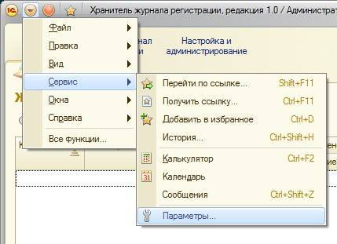
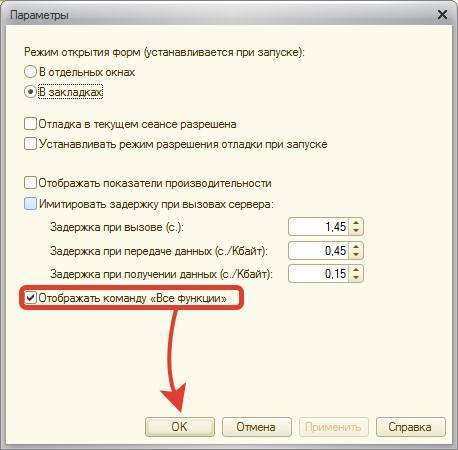
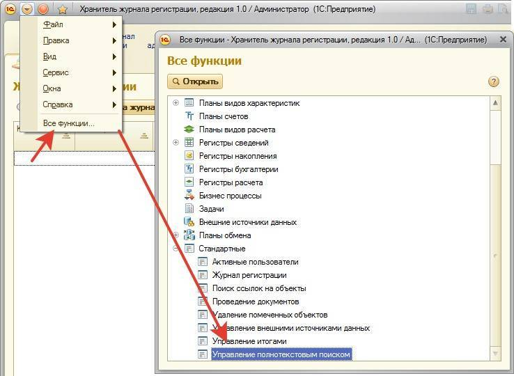
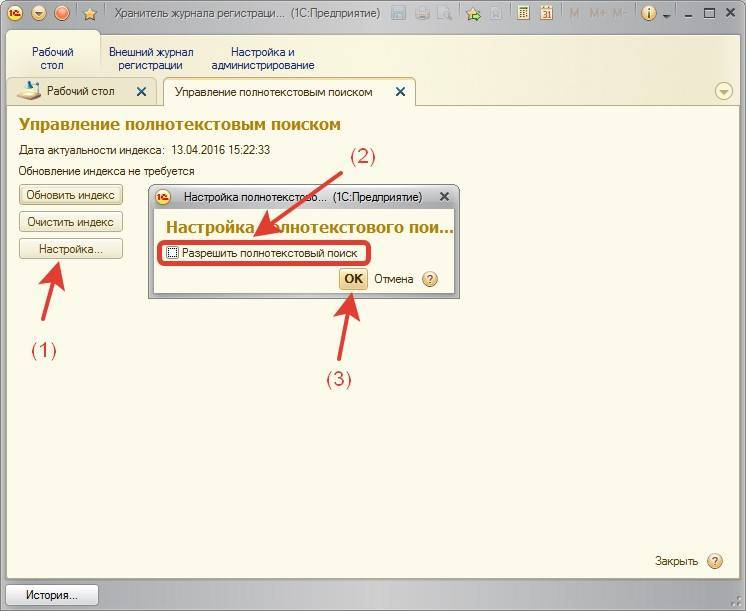

# Отключение полнотекствого поиска

Для того, чтобы Хранитель использовал меньше системных ресурсов рекомендуется отключить полнотекстовый поиск в хранителе. При этом поиск может быть уже отключен, но лучше проверить.

Сначала откроем команду **«Все функции»**. Сделать это можно в меню:

Далее включим галочку:

Теперь откроем сами настройки:

Отключим полнотекстовый поиск:

