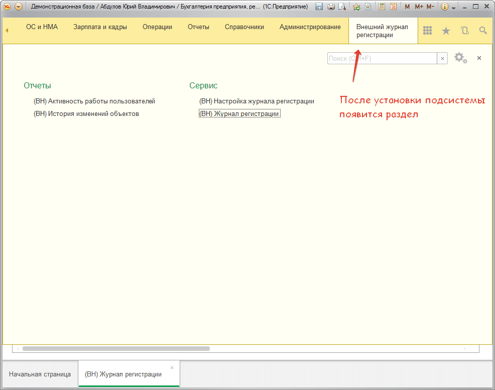
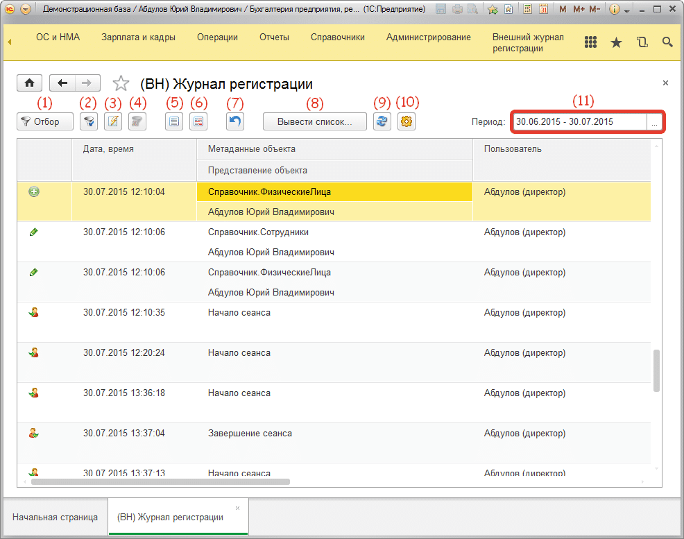
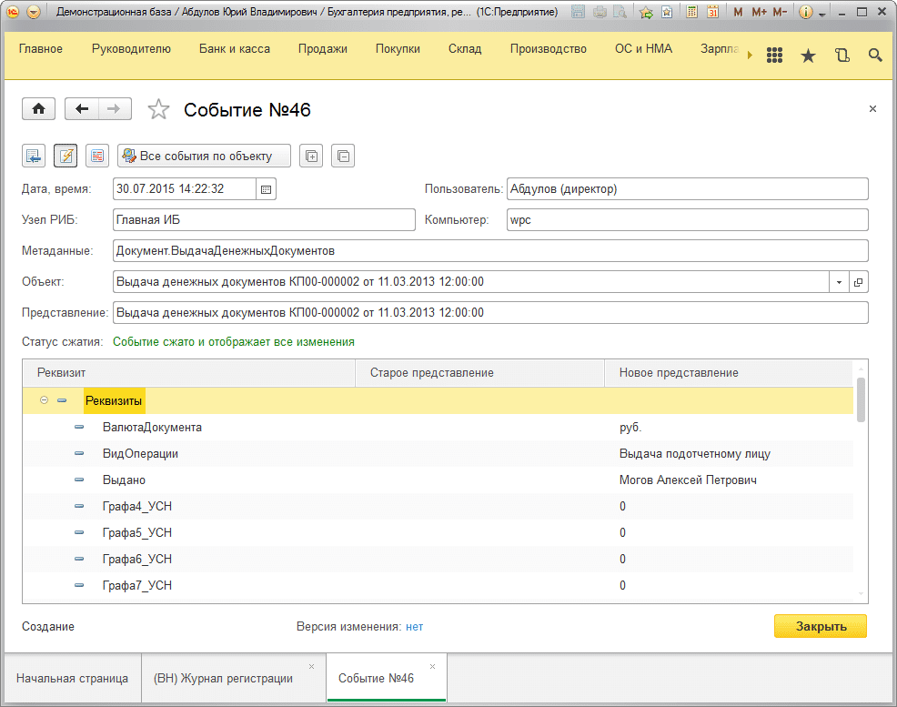
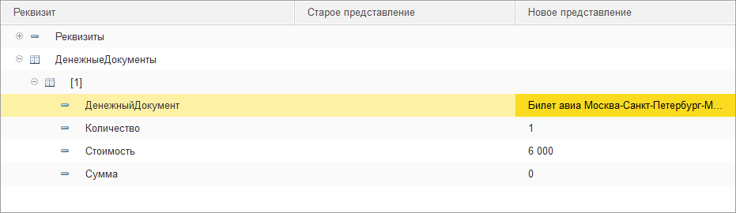

# Внешний вид

Открыть журнал регистрации можно следующим образом:

Открыть журнал регистрации могут пользователи, которые имеют одну из следующих ролей: **«(ВН) Просмотр журнала регистрации»** или роль **«(ВН) Администратор журнала регистрации»**.

Для открытия журнала регистрации щелкните по пункту **«(ВН) Журнал регистрации»**.

В появившемся окне Вы увидите все изменения внешнего журнала регистрации.

## Опишем все кнопки в журнале:

> **1** - Кнопка для вызова отбора в журнале регистрации.  
> **2** - Отбор по текущей строке. Т.е. если мы находимся, на какой-то строке в журнале регистрации и нажмем на данную кнопку, то получим все изменения по данному объекту.  
> **3** - Отбор только по событиям, в которых были изменения.  
> **4** - Отключение всех отборов.  
> **5** - Открыть конкретное изменение в журнале регистрации (аналогично можно щелкнуть на событие два раза мышкой).  
> **6** - Показать объект, для которого зафиксировано изменение с отображением прямо на форме объекта, что было изменено.  
> **7** - Вернуться к предыдущей версии текущего выделенного изменения в журнале регистрации.  
> **8** - Вывести все изменения в печатном виде для печати изменений.  
> **9** - Обновить события журнала регистрации. Журнал регистрации будет перезаполнен.  
> **10** - Открыть настройки журнала регистрации. Отображается только для пользователей с ролью администрирования журнала регистрации.  
> **11** - Период выборки изменений. Если обе даты пусты, то выборка ВСЕХ изменений. Не рекомендуется очищать обе даты т.к. это может снизить производительность выборки.  

При двойном щелчке на любой из показанных строк откроется более детальная информация по изменению, которое сделал пользователь.

А так выглядит табличные части этого же события:

На рисунке указано, что была изменена табличная часть **«Денежные документы»**, в которой 1 строка.
