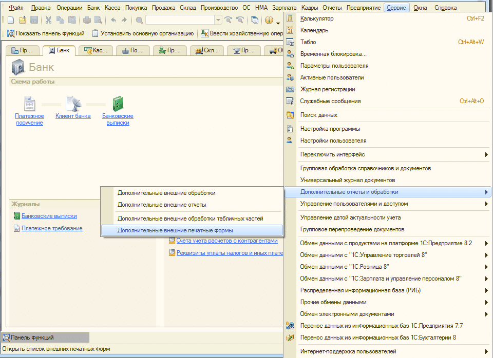
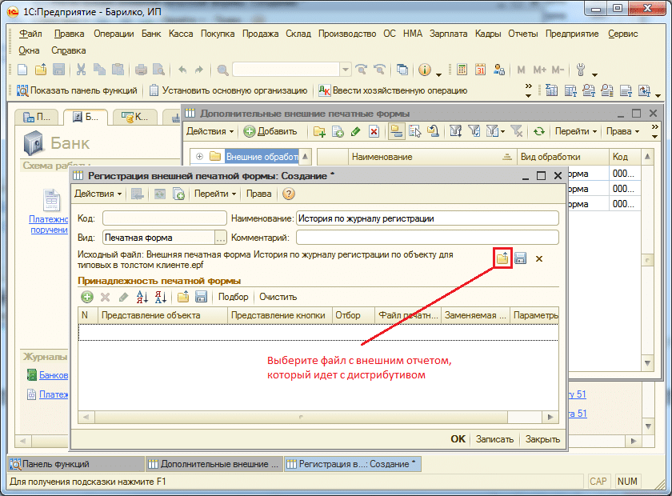
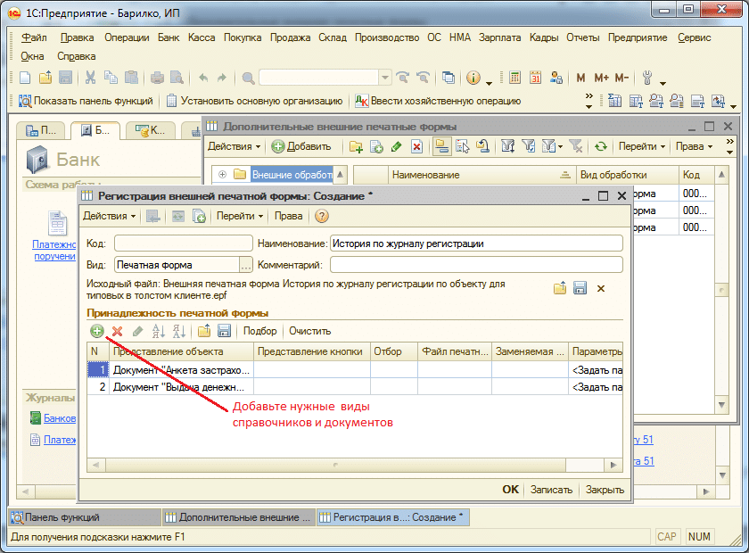

# Добавление в типовые конфигурации на обычных формах внешней печатной формы «История по журналу регистрации»
В подсистеме предусмотрена возможность добавления в типовые конфигурации: **ЗУП 2.5, БП 2.0, УТ 10.3** и т.д. внешней печатной формы «История по журналу регистрации»

Для этого зайдите в конфигурацию в режиме Предприятия и откройте внешние печатные формы. Для **БП 2.0** это выглядит так:

Откроется форма:

После этого заполните табличную часть нужными справочниками и документами:

Теперь в выбранных документах при нажатии на печать появится дополнительная внешняя печатная форма **«История по журналу регистрации»**.