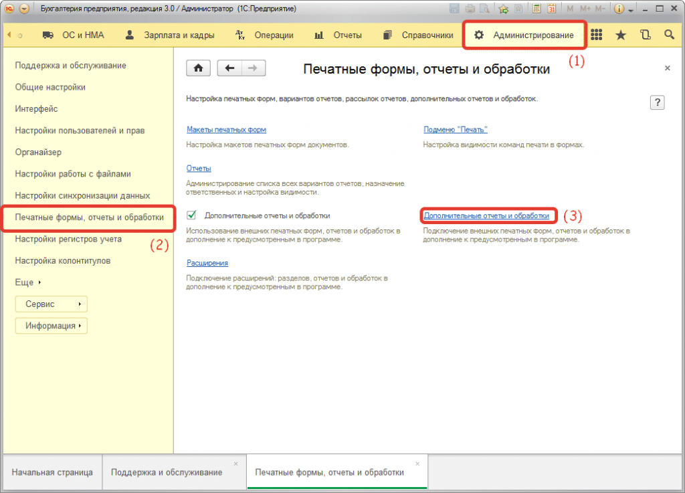

# Добавление в типовые конфигурации на управляемых формах внешней печатной формы «История по журналу регистрации»

Откройте **«Администрирование»** и найдите **«Печатные формы, отчеты и обработки»**:

Далее, в открывшейся форме нажмите **«Создать»** и выберите файл с внешним отчетом **«История изменений объекта по журналу регистрации.epf»** из дистрибутива. По умолчанию печатная форма будет добавлена ко всем объектам ссылочного типа, где есть вывод печатных форм.  

Затем в объектах при нажатии кнопки **«Печать»** появится либо пункт **«Дополнительные печатные формы…»**, либо **«История изменений объекта по журналу регистрации»** по нажатии на который будет открываться форма журнала с отбором по текущему объекту.
