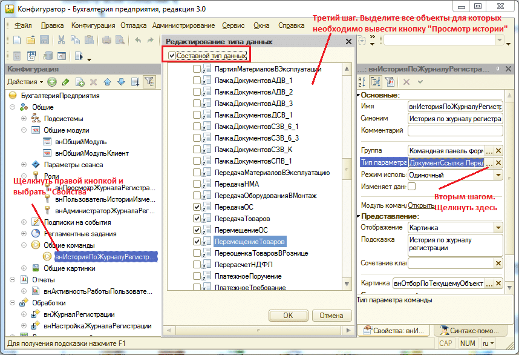
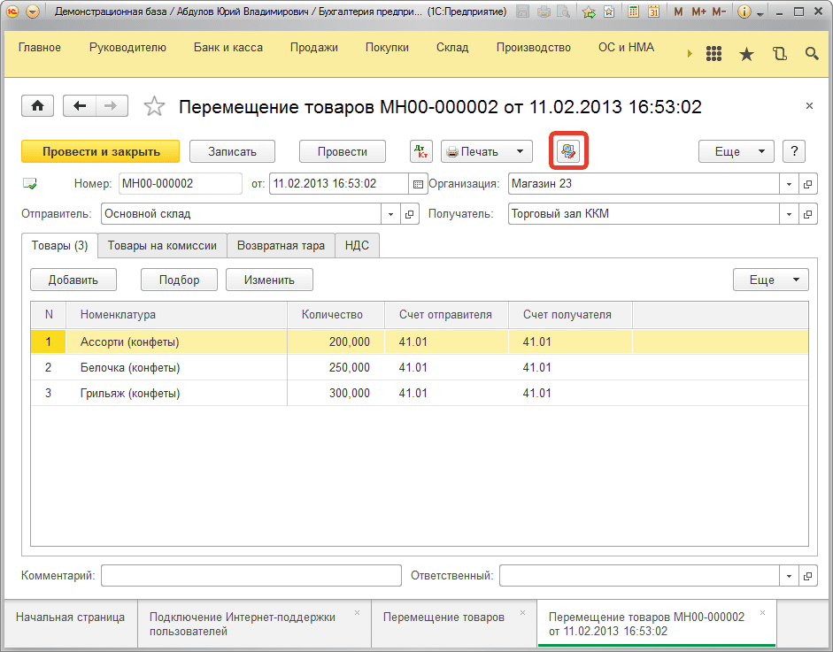
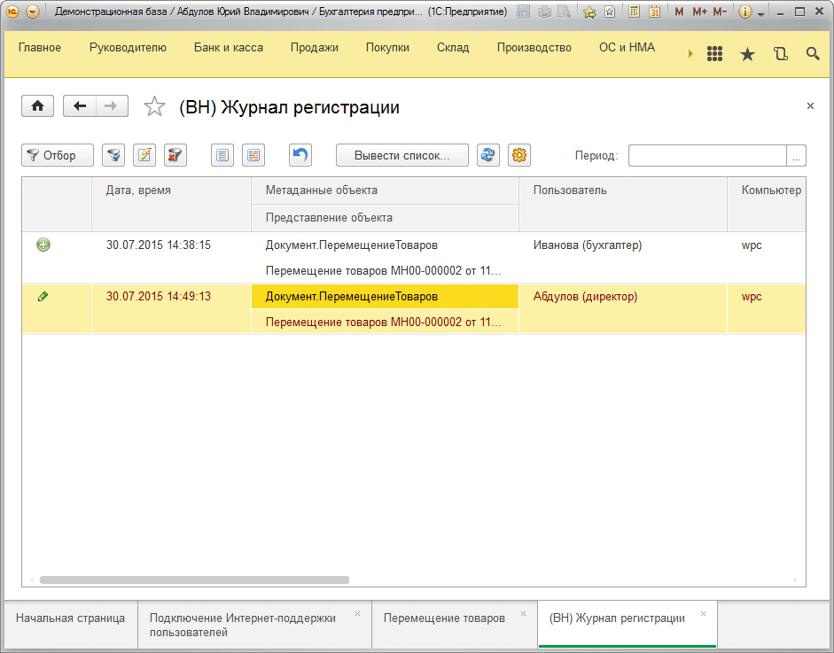

# Добавление в управляемое приложение команды вывода изменений объектов
В подсистеме предусмотрена возможность добавления в конфигурациях на управляемых формах кнопки в формы справочников и документов для вывода журнала и автоматическом отборе по заданному объекту всех событий.

Для этого в конфигураторе заполним параметры команды **«внИсторияПоЖурналуРегистрации»** как указано ниже. При этом на третьем шаге выделите те объекты, для которых Вы хотите видеть кнопку **«История по журналу регистрации»**.

После этого шага нажмите **«ОК»** и сохраните конфигурацию нажав клавишу `F7`. Теперь запустите информационную базу 1С в режиме предприятия. Видим, что появилась кнопка **«История по журналу регистрации»** во всех документах **«Перемещение товаров»**:

При ее нажатии будет открыт журнал регистрации с установленным отбором по этому объекту.

