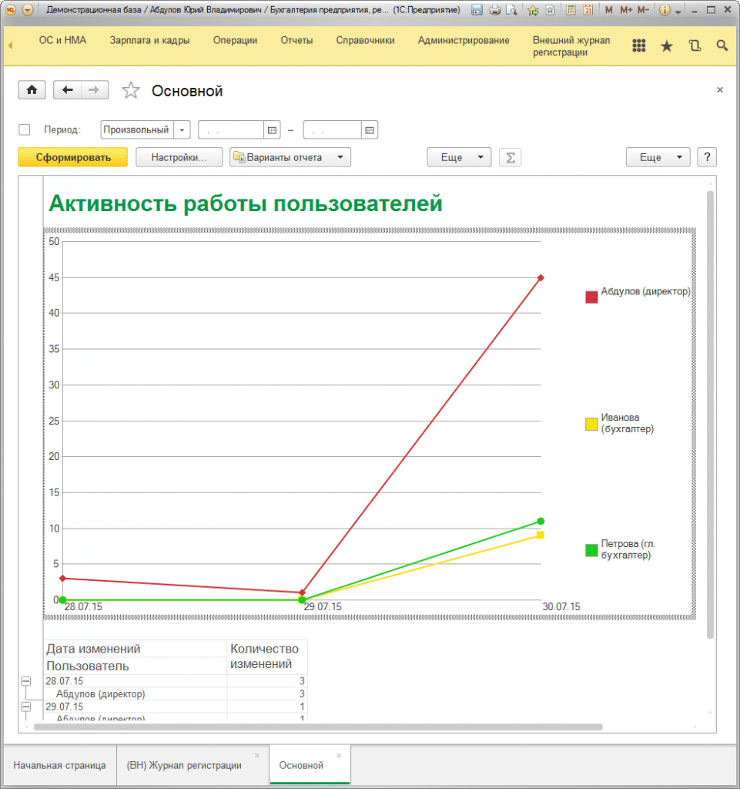

# Как посмотреть активность работы пользователей 

Многие сотрудники, занимающие руководящие должности иногда интересуются, как активно их подчиненные работают в информационной базе. Для этих целей был разработан специальный отчет **«Активность работы пользователей»**, который предоставляет сведения как в графическом виде, кто как работает и сколько записей каждым сотрудников было внесено в журнал регистрации *(и, соответственно, сколько объектов было записано в информационную базу 1С).*

Отчет ясно указывает на то, что пользователь **«Абдулов (директор)» 30.07.15** работал больше всех, а вот **«Иванова (бухгалтер)»** практически ничего не делала… Так же ниже диаграммы располагаются сводные данные по пользователям и дням работы.
