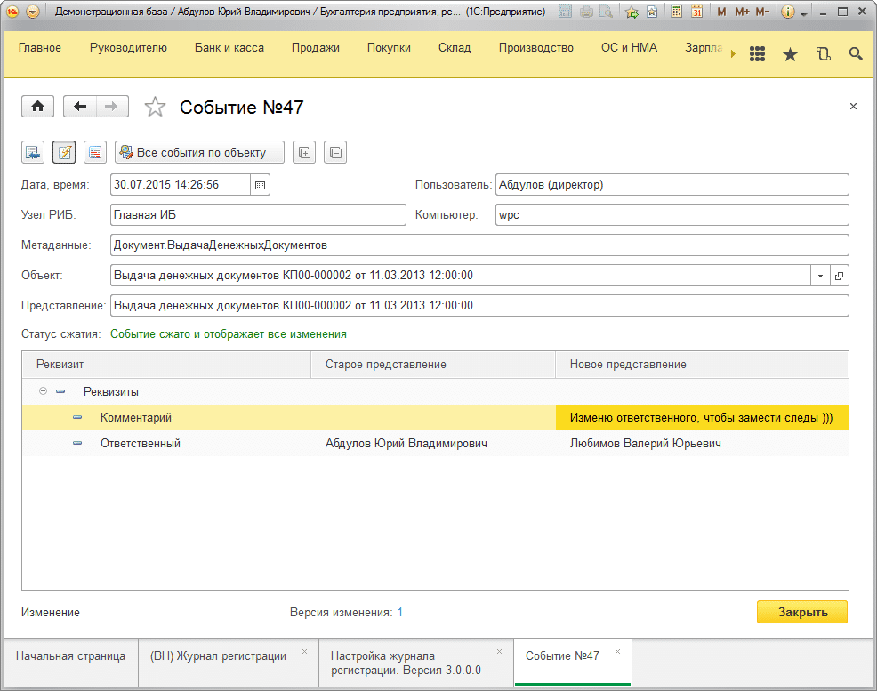

# Как увидеть, кто изменил, что было и что стало с объектом?
Итак, документ создан нами, все хорошо, но вдруг, какой-то нерадивый пользователь изменил наш драгоценный документ. Как увидеть, кто изменил, что изменил и т.д. в деталях?

Для этого необходимо два раза щелкнуть в нашем журнале регистрации или нажать `Enter` в соответствующей строке журнала.

Выглядеть это будет так:

Мы видим, что было изменено 2 реквизита:  
Комментарий и ответственный. Сделал эти изменения пользователь: **«Абдулов (директор)» 30.07.2015 в 14:26!**

Старое значение комментария было пустым, новое стало **«Изменю ответственного чтобы замести следы )))»** и изменился реквизит **«Ответственный»** поменялся с Абдулова на Любимова.

Подсистема предоставила исчерпывающую информацию об изменении.