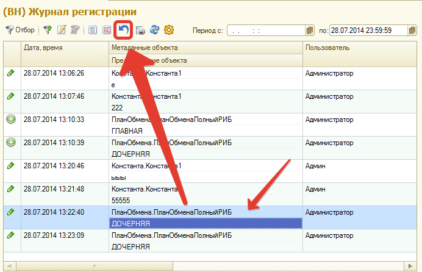

# Откат изменений на предыдущие версии объектов

Очень часто в работе бывают ситуации, когда кто-то сделал не желательные изменения, виновные найдены и наказаны, но теперь, после всего этого, хочется вернуть «все как было». Для этих целей в подсистеме разработан специальный механизм, который возвращает объект к предыдущей версии.
Для отката к предыдущей версии станьте на изменение в журнале регистрации, которое Вы хотите «откатить» назад и нажмите на кнопку в панели как на рисунке:

После этого Вам будет открыта форма объекта с изменениями отката, либо выдано сообщение с невозможностью произведения отката.

!!! Warning Внимание! 
Откат можно провести только для объектов ссылочного типа.
!!!