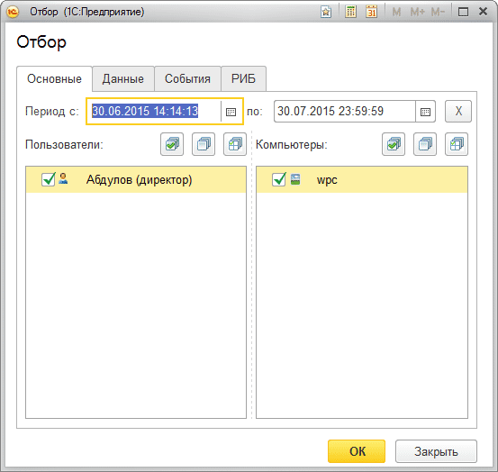
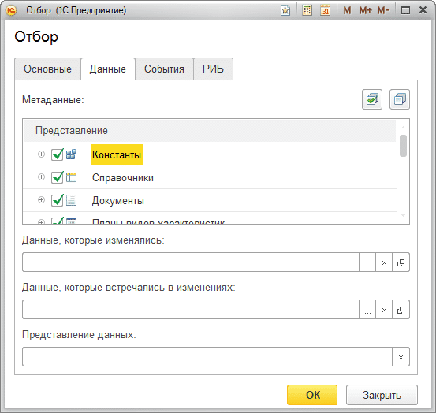
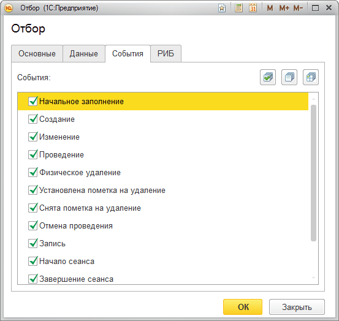
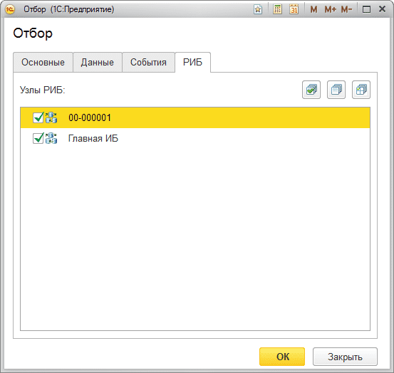

# Установка отборов
## Отборы позволяют отобрать изменения по определенному критерию, который можно задать. 
**А именно:**

*Закладка «Основные»*

- по периоду;

- по пользователю(ям);

- по компьютеру(ам);

*Закладка «Данные»*

- по видам объектов (Метаданные);

- по конкретному объекту (Данные, которые изменялись);

- по вхождению конкретного объекта (Данные, которые встречались в изменениях);

- по представлению данных (подстрока);

*Закладка «События»*

- по типу событий.

*Закладка «РИБ»*

- по распределенной информационной базе

Устанавливая те, или иные галочки можно добиться необходимого отбора событий.