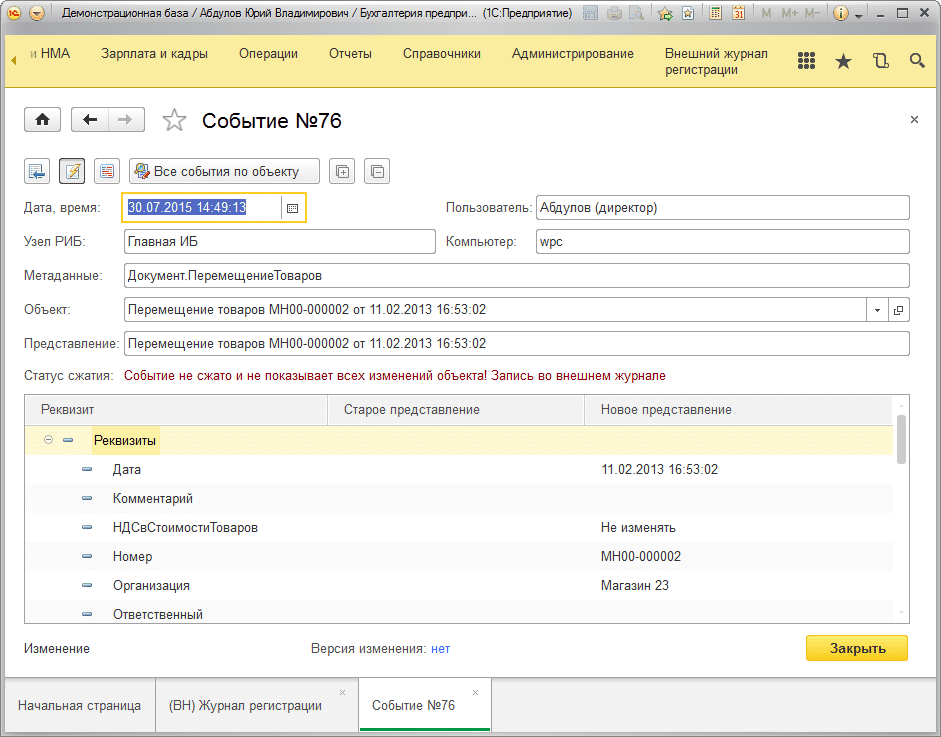
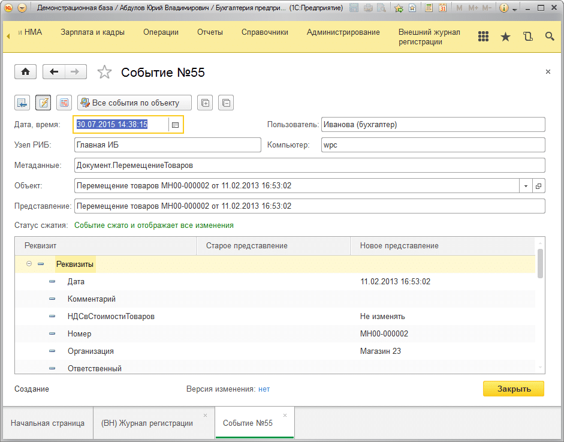
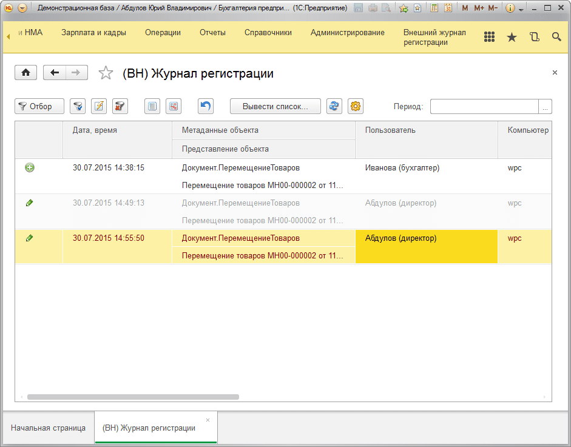

# Цветовая индикация записей в журнале

## В журнале у событий есть несколько стадий:

1) Запись находится в кэше и не попала во внешнюю ИБ **«Хранитель журнала регистрации»** (записи отражаются темно-красным цветом)

2) События, которые находятся в базе хранителя и для них еще не определены изменения (отображаются светло-серым цветом) Т.е. эти данные, которые еще не обработаны.

3) События, которые находятся в базе хранителя и для них были найдены изменения обработаны обычным черным цветом.

Как уже было сказано ранее, данные в кэше содержат полный образ объекта на момент изменения объекта (содержат все реквизиты, все табличные части, все предопределённые реквизиты), а в хранителе хранятся те же полные образы, но уже с определением изменений, т.е. как было и как стало. Но определяются изменения в объектах не сразу, поэтому и введено еще одно состояние объектов с серым цветом. После обработки запись становится черного цвета, что свидетельствует о том, что запись обработана.

Вот записи с разными статусами:

Обратите внимание на поле **«Статус сжатия»**.

А вот как в журнале отображаются эти записи:

