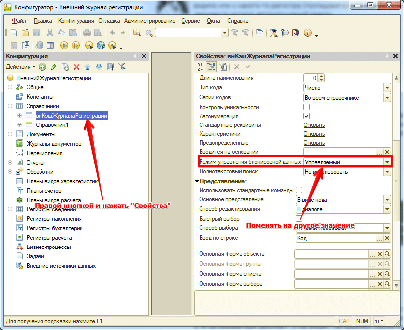

# В стандартном журнале фиксируются ошибки фонового задания подсистемы 

Если появились ошибки типа:
```bsl
{ОбщийМодуль.внЖурналРегистрации.Модуль(2229)}: Ошибка при вызове метода контекста (Удалить) Объект.Удалить();

по причине: Ошибка использования Менеджера блокировок Автоматический режим блокировки недопустим в этой транзакции.
```
Эта ошибка появляется, в случае, если во внедряемой конфигурации на справочнике режим блокировки данных может отличаться. Для решения этой проблемы откройте конфигуратор и:



Поменяйте режим управления блокировкой данных на другое значение.  
После смены режима необходимо обновить конфигурацию базы данных (нажать `F7`). Ошибка должна исчезнуть.