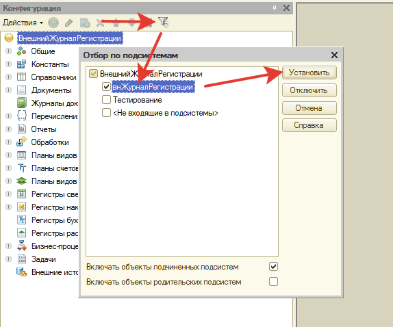

Как удалить журнал регистрации из рабочей информационной базы   
Да, конечно, это возможно. Перед удалением в информационной базе в режиме предприятия никто не должен работать.

Для удаления сделайте отбор по подсистеме **«внЖурналРегистрации»** как на рисунке ниже:

После этого удалите все объекты с префиксом «вн» (которые начинаются с «вн») начиная с объектов: регистры сведений, затем отчеты и обработки, затем перечисления и наконец все остальное. Последним необходимо удалить подсистему «внЖурналРегистрации».

После удаления всех этих объектов сохраните конфигурацию `Ctrl+S` и обновите конфигурацию базы данных `F7`.

После этого журнал будет удален из информационной базы.
