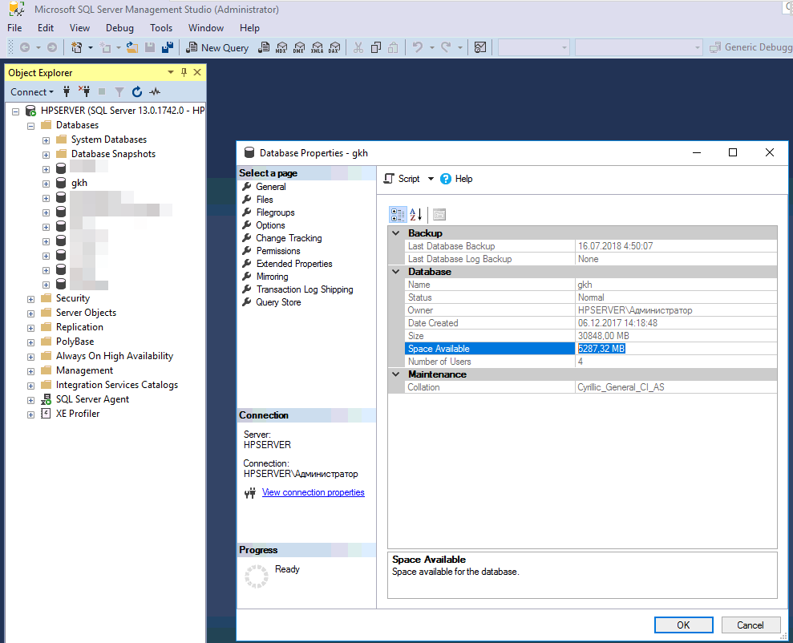
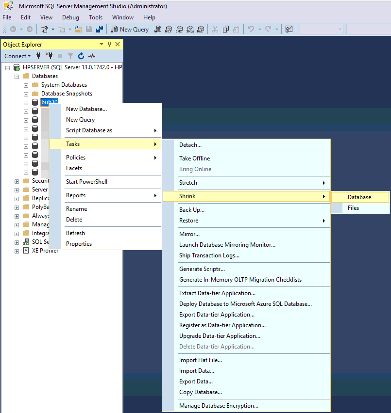
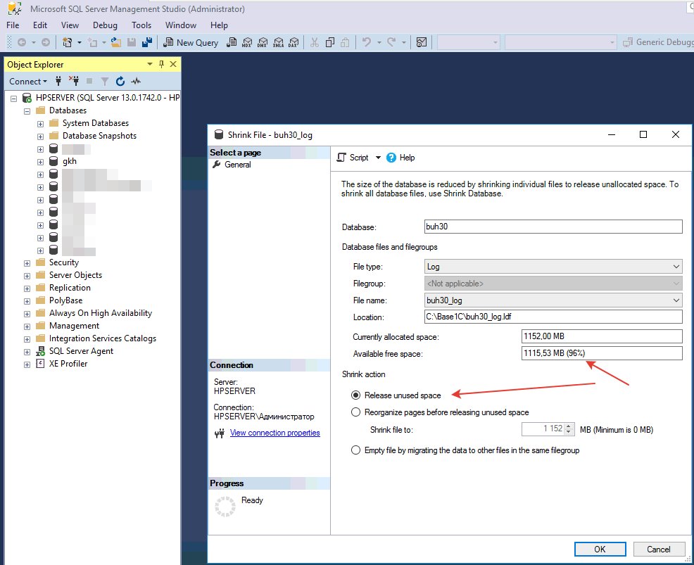

# После обновления или в процессе работы базы 1С на MS SQL сильно увеличилась в размерах. Что нам делать?

Часто так бывает, что до обновления база Хранителя была, допустим, 80 Гб, а после обновления 200 Гб.  

Не надо паниковать, надо разобраться почему так произошло. Дело в том, что в процессе обновления происходит следующее: некоторые объекты изменяются, делаются переносы объектов в новые сущности (например, был справочник его переносят в регистр) и т.д. Для быстродействия `MS SQL` выделяет 1С, если тому потребуется дополнительное пространство, а если в настройках базы стоит автоувеличение размера БД шагом, скажем, в 500 Мб, то база вырастает очень быстро. При этом `MS SQL` при удалении объектов в пространство, которое освободилось не торопится записывать новые объекты и/или сжимать базу. Опять же, все сделано в угоду скорости работы обычного пользователя, чтобы он ничего не заметил.  
**Как же заставить `MS SQL Server` уменьшить размер БД?**  
Давайте сделаем это вручную.  

## Ручное сжатие (shrink) БД MS SQL

1. Откроем для начала свойства БД в `Microsoft SQL Server Managment Studio`. Правой кнопкой по интересующей нас базе и `Properties` (Свойства)



Смотрим `Space Avalilable` (Свободное пространство) 5287,32 Мб. где общий размер базы Size (Размер), равен 30828 Мб.
Так. Значит безболезненно мы можем уменьшить размер базы данных, примерно на 5 Гб. Серьезная цифра... Приступим.

2. Так же щелкаем по нужной БД правой кнопкой мыши и в меню:



**Выбираем Task > Shrink > Files, либо Task > Shrink > Databases.**  
В зависимости от того, что выбрать мы определим способ уменьшения размера.  
Если выберем `Files`, то будет возможности очистки файла данных `*.mdf` и файла лога транзакций `*.ldf`, под очисткой, конечно же понимается не ручное удаление файлов :), а очистка средствами `MS SQL`. Точнее даже не очистка, а сжатие свободного пространства, которое образовалось в файлах `SQL` во время работы. 



Выбираем File type в `Log` (очистка LDF-файлов транзакций) и нажимаем **OK**.
После этого свободное место будет удалено и размер БД MS SQL уменьшится.
Аналогично можно проделать и с File type равным Data, но там данных будет удалено меньше, все таки это файл данных, а не лога транзакций.
Так же можно сделать на `Shrink File`, а `Shrink Database`, которое очистит и `LDF` и `MDF` от лишнего места. Но выбор этого пункта плох тем, что нужен монопольный доступ к БД.

Если нам нужно автоматическое сжатие, скажем, раз в неделю, то необходимо добавить задание в MS SQL, которое будет выполнять команду по сжатию нужных БД, либо выполнять запрос вида
```
DBCC SHRINKDATABASE
( database_name | database_id | 0
[ , target_percent ]
[ , { NOTRUNCATE | TRUNCATEONLY } ]
)
[ WITH NO_INFOMSGS ]
```
в нашем случае это будет
```
DBCC SHRINKDATABASE (gkh)
```
!!! Warning Важно! 
Если размер базы не уменьшается после выполненных операций, обратите внимание на монопольность работы с БД MS SQL. Если кто-то работает с базой (регламентные задания, пользователи работают с 1С и эта база используется 1С), то возможно не полное освобождение свободного пространства. С базой в этот момент никто не должен работать кроме вас.
!!!