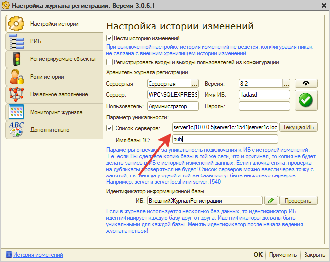

# Регистрируются изменения только для некоторых пользователей 

Частый вопрос, который возникает у пользователей.  
На самом деле тут важно понимать, как записывается событие при изменении объекта.  
***Схема записи следующая:***
1) Проверка входит ли изменяемый объект в список регистрируемых, если не входит не записываем событие.  
2) Проверка есть ли у пользователя роль "(ВН) Не фиксировать изменения журнала регистрации", если есть не записываем событие.  
3) Проверка подходят ли параметры уникальности текущей информационной базы, если не подходят не записываем.  

Если все условия выполняются происходит запись события. С первыми двумя все понятно, проверить их просто, но вот последнее часто является камнем преткновения и не многие понимают, зачем "оно" нужно.

Опять же, тут все достаточно просто. Параметры уникальности дают нам проверку следующего вида "А это изменение не в копии базы?", если да то понятное дело его фиксировать не нужно, чтобы события копии не попадали в хранитель.  

Теперь по настройки этого механизма. Самое простое, если бьетесь и не можете решить - просто отключите проверку уникальности и все.  

Если же вы хотите настроить все "по уму", то первое, что нужно сделать: 
> соберите все возможные представления сервера 1С для ИБ, которые вы подключаете пользователям. Да, они могут быть разными. Базу можно подключить и в качестве сервера 1С задать `"server1c"` (без кавычек), а можно `"10.0.0.5"` (ip-адрес сервера 1С), а можно `"server1c:1541"`, `"server.local"` и т.п. Заметьте, что если в качестве сервера написать один из подобные вариантов - это будет работать и пользователи будут подключаться к базе. Но т.к. параметры уникальности допустим прописаны: `"server1c"` (без кавычек), а пользователю на его рабочем месте база подключена как `"10.0.0.5"` (без кавычек), то подсистема думает, что параметр уникальности не совпадает для этого пользователя и для этой базы и не записывает события.  
> Составьте строку подключения представления серверов (регистр букв не имеет значения) и запишите их, либо через запятую в поле настройки, либо с использованием символа вертикального слеша **"|"** (без кавычек).  
Т.е. для примера, который мы указали выше строка будет выглядеть вот так:
**server1c|10.0.0.5|server1c:1541|server1c.local**

А вот настройка в программе.