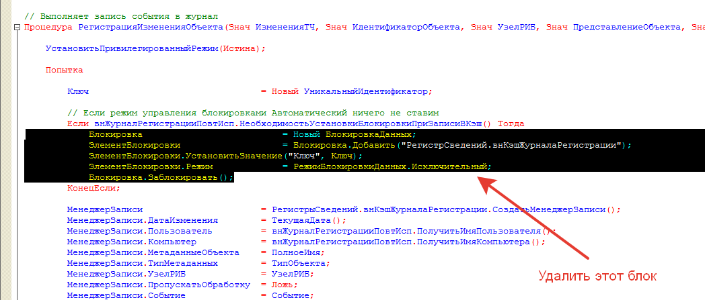

# Установил журнал регистрации но в журнал попадают только "Начало сеанса" и "Завершение сеанса" и событие "Физическое удаление"    

Если по какой-то причине ничего не регистрируется смотрите в стандартный журнал регистрации, ошибки регистрации будут отображены там.
Скорее всего дело в том, что у конфигурации режим разделения блокировки стоит **Автоматический**, а у регистра, куда пишутся события, стоит **Управляемый**.
Что нужно сделать, чтобы решить проблему?  
* Измените в регистре режим блокировок на **Автоматический** для регистр сведений **"внКэшЖурналаРегистрации"**
* В процедуре модуля внЖурналРегистрацииСервер измените процедуру удалив блок как на скриншоте (может чуть-чуть отличаться код, надо удалить блокировку):

