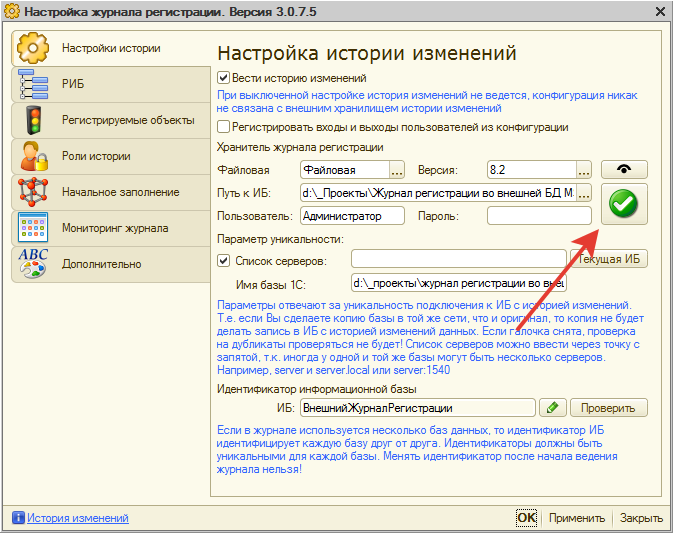
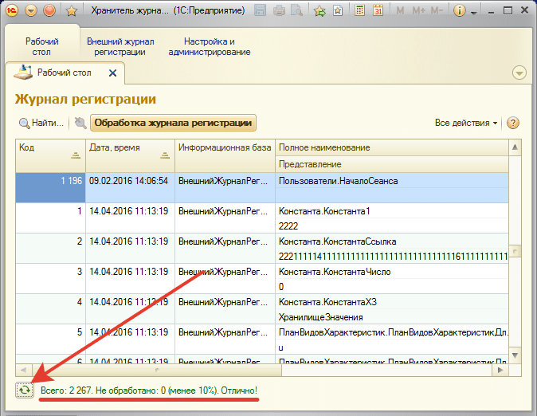
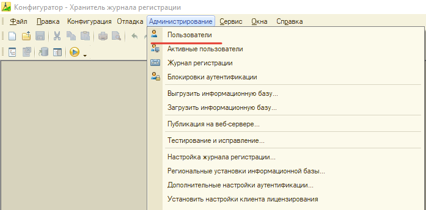
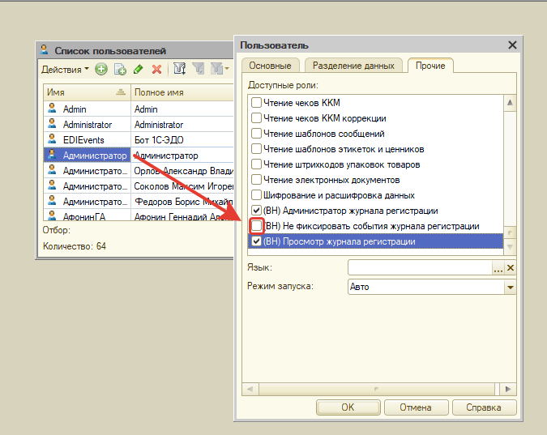

# Что делать, если события не попадают из рабочей ИБ в Хранитель

**Этот вопрос часто задают те, кто устанавливают подсистему и не понимают почему события не выгружаются в Хранитель.**
## Рассмотрим основные причины такого поведения:

1. Проверьте соединение с хранителем. Для этого зайдите в настройки подсистемы, и проверьте соединение с хранителем



Если появилась надпись "Все параметры подключения установлены правильно", то переходим к следующему пункту, если нет, то смотрим статью 
[Не работает проверка соединения с конфигурацией «Хранитель» из подсистемы или ошибка «Недопустимая строка с указанием класс"](https://softonit.ru/FAQ/courses/?COURSE_ID=2&LESSON_ID=194&LESSON_PATH=5.190.194)
2. Заходим на закладке "Мониторинг журнала" и нажимаем кнопку "Перенос во внешнюю ИБ", попробуем вручную перенести события. Будет большая пауза в этот момент открываем конфигурацию "Хранитель" и смотрим увеличивается ли количество событий в "Хранителе" периодически нажимая кнопку **"Обновить"**



Если количество увеличивается, но автоматически ничего не переносится, тогда переходим к следующему пункту, иначе, надо вернутся к пункту 1. 

3. Если вручную все переносится, а программно (с помощью регламентного задания) нет, то необходимо проверить [параметры уникальности](https://softonit.ru/FAQ/courses/?COURSE_ID=2&LESSON_ID=159&LESSON_PATH=5.158.159).  
Они предназначены для того, чтобы события из копий не попадали в хранитель.
Перво-наперво проверьте расписание регламентного задания "(ВН) Перенос кэша журнала регистрации", сделать это можно в настройках конфигурации в режиме предприятия, либо через консоль регламентных заданий. Если расписание в норме, попробуйте вручную запустить регламентное соответствующей кнопкой.  
Перейдите в стандартный журнал регистрации и найдите в нем строки по запуску этого регламентного задания. Если обмен не пошел, то там будет информация о причинах того, почему не работает автоматическая выгрузка событий.  
Отключите параметры уникальности и снова попробуйте запустить регламентное или дождаться его выполнения. Если после этого обмен был успешным, то необходимо настроить параметры уникальности.  
Для этого переключите все возможные варианты именования сервера 1С в строке "Список серверов" и отделите их друг от друга либо точкой с запятой, либо символом вертикального слэша `"|"`, например:

```
server1с;192.168.1.10;server1c.local;server1с:1591;...
```
**server1c - это имя вашего сервера 1С.**  
Перечислите все возможные варианты, которые могут возникнуть у Вас или у Ваших пользователей при подключении основной базы пользователям.
Имя базы должно соответствовать реальному имени.  

Эти параметр дают то, что в тестовой базе параметры подключения будут другими и из тестовой базы ничего не будет выгружаться в Хранитель, а из реальной базы будет, т.к. параметры подключения совпадут. Это, как бы, щит от событий сделанных в копиях базы.   

Если у Вас нет копий рабочей базы, а только рабочая база, и при этом ручной перенос работает, то можете отключить "флаг" (галочку) проверки параметров уникальности рядом с реквизитом списка серверов.  
Если же копии есть, то этот флаг обязателен. Все проблемы обычно из-за того, что не верно установлен параметр список серверов в параметрах уникальности в стандартном журнале при не возможности подключения будет написано правильное имя сервера и информационной базы.  

4. Иногда при присвоении прав пользователю, администратор устанавливает права "(ВН) Не фиксировать события журнала регистрации". Соответственно, у пользователя с данными правами, в журнале изменений события не будут фиксироваться.   

**Решение: Проверьте права пользователя. Для этого откройте рабочую базу в режиме  конфигуратора. Пройдите в Администрирование - Пользователи - Прочее, и убедитесь, что не стоит галочка : "Не фиксировать события журнала регистрации".**


