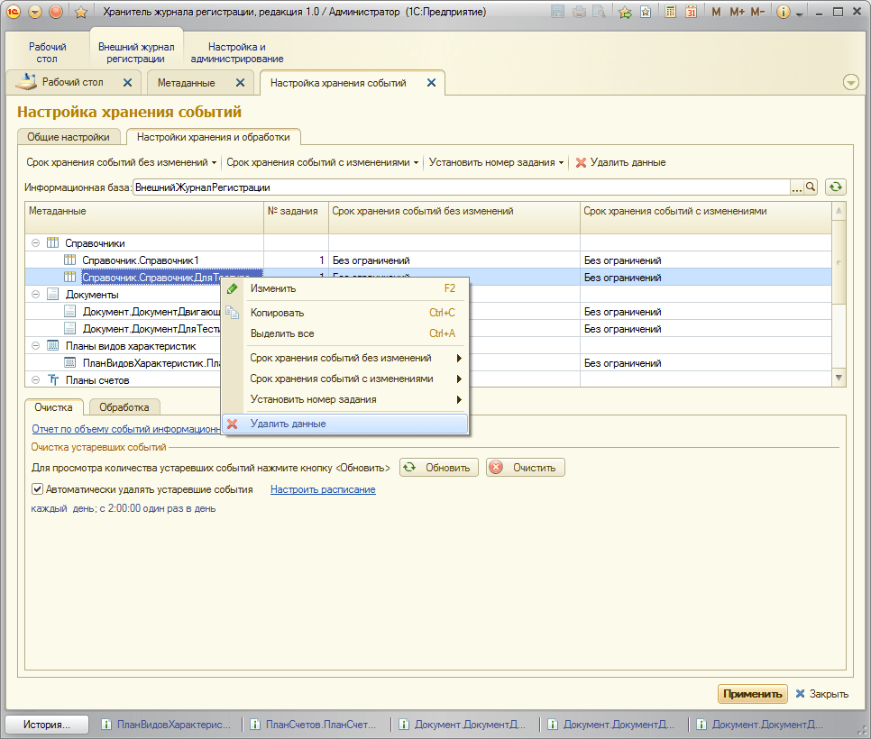

# В хранитель был перенесен лишний объект/объекты. Как мне его удалить? 

Действительно, такое бывает очень часто. Настроили журнал, сделали заполнение, а потом поняли, что какой-то объект или целую группу объектов регистрировать не нужно (занимает место, но данные по этим событиям не используются).  
Для удаления событий по этому объекту необходимо открыть ИБ **"Хранитель журнала регистрации"** перейти в подсистему **"Внешний журнал регистрации" > Настройки**, закладка **"Настройки хранения и обработки"**, щелкнуть правой кнопкой по нужному объекту и выбрать **"Удалить данные"**.

